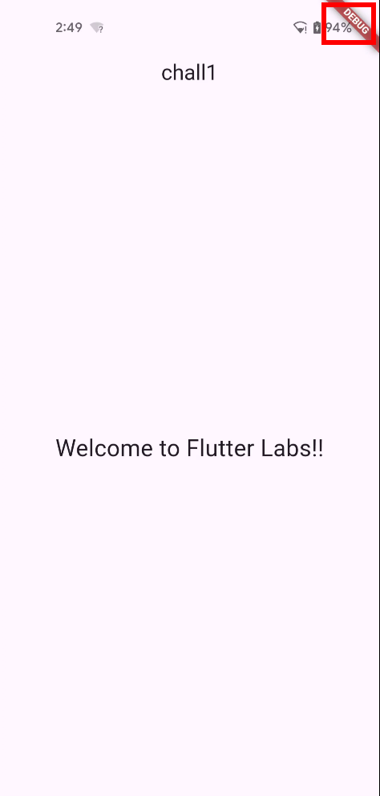
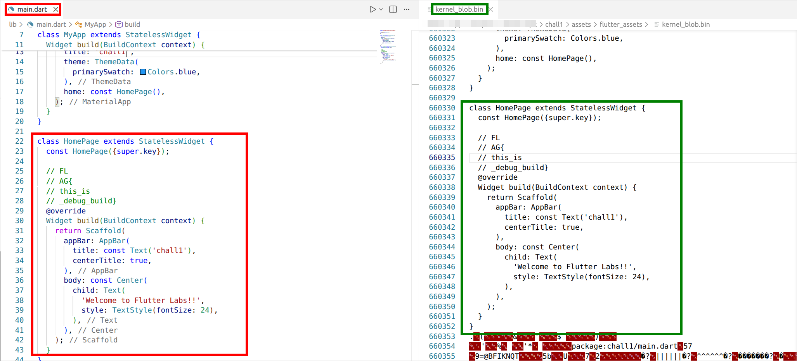

# Challenge 1: Debug Mode - Source Code Leakage

## Overview

When you first launch the application, you're greeted by a simple screen displaying the message "Welcome to Flutter Labs!!".



The first thing you'll notice when you open this application is the "DEBUG" banner in the top right corner. This is a clear indication that we're dealing with a Flutter app built in debug mode. But what does that actually mean, and why should we care from a reverse engineering perspective?

### What is Flutter and How Does It Work?
Flutter is Google's open-source framework for building cross-platform applications. You write your code once in Dart, and Flutter compiles it to run on Android, iOS, web, and desktop platforms.

Flutter apps can be built in three different modes:
- **Debug mode**: Used during development. Includes debugging information, hot reload support, and the Dart source code is kept in a readable format in the `kernel_blob.bin` file;
- **Profile mode**: Similar to release mode but with performance profiling enabled. This mode is rarely shipped to end users and is mainly used internally for performance analysis, so we'll skip it in these labs;
- **Release mode**: Optimized for production use. The Dart code is compiled ahead-of-time (AOT) into native machine code stored in `libapp.so`, making it much harder to reverse;

When you're developing a Flutter app, you write Dart code (usually in `lib/main.dart`), and Flutter's toolchain compiles it. In debug mode, this compilation is kept "lightweight" - the Dart code is essentially packaged in a semi-readable format so that features like hot reload can work. In release mode, everything gets compiled down to native code.

## Analysis

Let's dig into this APK and see what we can find. We'll use `apktool`, which is the go-to tool for unpacking Android applications. Apktool decodes the resources, extracts assets, and disassembles the DEX files (Android's executable format).

```shell
$ apktool d chall1.apk
I: Using Apktool 2.8.1 on chall1.apk
I: Loading resource table...
I: Decoding AndroidManifest.xml with resources...
I: Loading resource table from file: /home/bruno/.local/share/apktool/framework/1.apk
I: Regular manifest package...
I: Decoding file-resources...
I: Decoding values */* XMLs...
I: Baksmaling classes.dex...
I: Baksmaling classes2.dex...
I: Baksmaling classes3.dex...
I: Copying assets and libs...
I: Copying unknown files...
I: Copying original files...
I: Copying META-INF/services directory
```

Once the extraction is complete, navigate to `chall1/assets/flutter_assets/` and you'll find a file called `kernel_blob.bin`.

### What is `kernel_blob.bin`?
This file is essentially the heart of a debug-mode Flutter app. It contains the Dart kernel bytecode - a serialized representation of your Dart code that includes class structures, methods, and even comments. *Think of it as a halfway point between source code and machine code.*

From a reverse engineering perspective, debug builds are almost embarrassingly easy to analyze. The `kernel_blob.bin` file is just a binary format, but if you open it with a text editor or run `strings` on it, you'll often find readable Dart code, variable names, comments, and class structures just sitting there.

In this case, inspecting `kernel_blob.bin` reveals the contents of `main.dart`, complete with class names, widget structure, and comments (note that the comments will be removed in a release build). Although the file is large, searching for entries such as `void main`, `MyApp`, or `class HomePage` allows the source code to be located quickly.

**File:** `chall1/assets/flutter_assets/kernel_blob.bin`
```text
...
class HomePage extends StatelessWidget {
  const HomePage({super.key});

  // FL
  // AG{
  // this_is
  // _debug_build}
  @override
  Widget build(BuildContext context) {
    return Scaffold(
      appBar: AppBar(
        title: const Text('chall1'),
        centerTitle: true,
      ),
      body: const Center(
        child: Text(
          'Welcome to Flutter Labs!!',
          style: TextStyle(fontSize: 24),
        ),
      ),
    );
  }
}
...
```

For completeness, the screenshot shows that the source code defined in `main.dart` is accurately reflected in the generated `kernel_blob.bin`.



## Flag
FLAG{this_is_debug_build}

---

# Deep Dive: Understanding Flutter Build Modes
Understanding Flutter build modes is essential before moving on to more challenging reversing scenarios. Flutter provides three primary build modes, each designed for a specific purpose and with distinct characteristics that affect both performance and reverse-engineering difficulty.

**Debug mode** is intended for development and debugging. As introduced before, in this mode the application includes extensive debugging information and runtime assertions, making it easier for developers to catch issues early. Hot reload is enabled, allowing rapid iteration during development. The Dart source code is preserved in a file called `kernel_blob.bin`, which makes analysis relatively straightforward. As a trade-off, the app size is larger and performance is slower compared to other modes. An APK in debug mode can be built using the command `flutter build apk --debug`.

**Profile mode** is designed for performance profiling rather than active debugging. Some optimizations are enabled to more closely resemble real-world performance, while profiling instrumentation is included to measure runtime behavior. Debugging UI elements are removed, and overall performance is better than in debug mode, though not as optimized as in release mode. You can build an APK in profile mode using `flutter build apk --profile`.

**Release mode** is used for production deployment and is the most relevant from a reverse-engineering perspective. In this mode, Flutter performs full ahead-of-time (AOT) compilation, converting Dart code into native machine code. The source code is compiled into a shared library called `libapp.so`, which contains machine instructions. Debugging information is stripped out, and the app is heavily optimized for both size and performance. Notably, `kernel_blob.bin` is not present in release builds. A release APK is built with the command `flutter build apk --release`.

## Practical Comparison: Debug vs. Release Builds
To see this difference in practice, consider building the same app in release mode. 

You can find the original Dart source code in [`src/main.dart`](../src/main.dart). 

Create a new Flutter project:
```shell
$ flutter create chall1

┌─────────────────────────────────────────────────────────┐
│ A new version of Flutter is available!                  │
│                                                         │
│ To update to the latest version, run "flutter upgrade". │
└─────────────────────────────────────────────────────────┘
Creating project chall1...
Resolving dependencies in `chall1`... (2.5s)
Downloading packages... 
Got dependencies in `chall1`.
Wrote 130 files.

All done!
You can find general documentation for Flutter at: https://docs.flutter.dev/
Detailed API documentation is available at: https://api.flutter.dev/
If you prefer video documentation, consider: https://www.youtube.com/c/flutterdev

In order to run your application, type:

  $ cd chall1
  $ flutter run

Your application code is in chall1/lib/main.dart.
```

Then replace the generated `lib/main.dart` with the provided source file.

Running `flutter build apk --release` produces an APK at `build/app/outputs/flutter-apk/app-release.apk`. 

```shell
$ flutter build apk --release
Running Gradle task 'assembleRelease'...                         1,882ms
✓ Built build/app/outputs/flutter-apk/app-release.apk (19.1MB)

```

After unpacking it with apktool, inspecting the `assets/flutter_assets` directory shows that `kernel_blob.bin` is completely absent. Instead, looking inside `lib/<arch>/` reveals files such as `libapp.so` and `libflutter.so`.

```shell
$ apktool d app-release.apk
I: Using Apktool 2.8.1 on app-release.apk
I: Loading resource table...
I: Decoding AndroidManifest.xml with resources...
I: Loading resource table from file: /home/bruno/.local/share/apktool/framework/1.apk
I: Regular manifest package...
I: Decoding file-resources...
I: Decoding values */* XMLs...
I: Baksmaling classes.dex...
I: Copying assets and libs...
I: Copying unknown files...
I: Copying original files...
I: Copying META-INF/services directory


$ find ./app-release/ -name "kernel_blob.bin"


$ find ./app-release/ -name "libapp.so"      
./app-release/lib/arm64-v8a/libapp.so
./app-release/lib/armeabi-v7a/libapp.so
./app-release/lib/x86_64/libapp.so
```

The absence of `kernel_blob.bin` and the presence of `libapp.so` highlight the key challenge of reversing release-mode Flutter applications. The Dart logic is no longer represented in a high-level, semi-readable form but as native machine code, which is significantly harder to analyze. In the upcoming challenges, we'll explore techniques and tools for tackling release-mode Flutter apps and extracting meaningful information from `libapp.so`.
