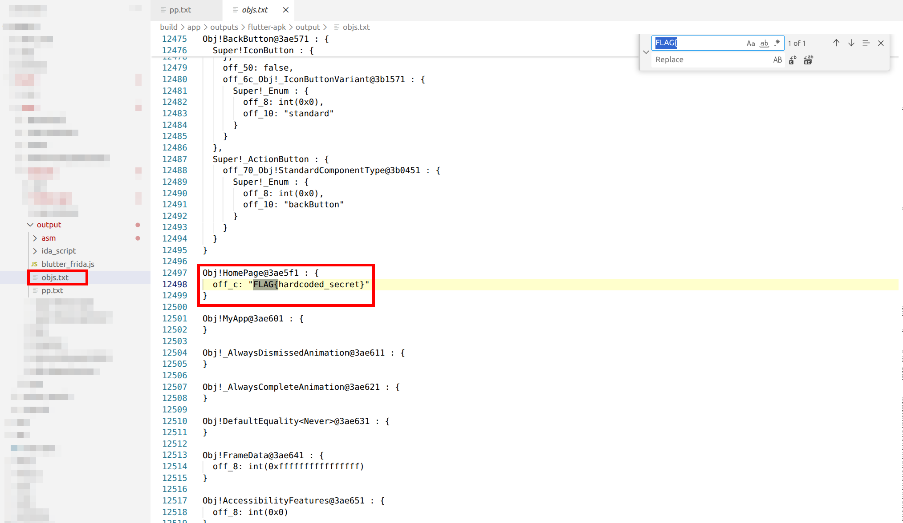
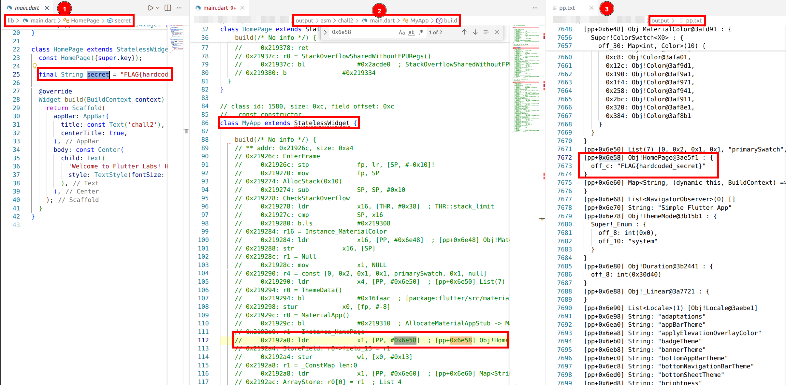
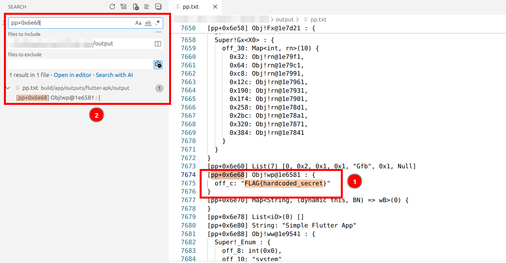

# Challenge 2: Release Mode - Finding Hardcoded Secrets
## Overview

Welcome back! In this challenge, we'll explore a Flutter application built in release mode. Upon launching the application, you are presented with a simple welcome screen displaying the message: "Welcome to Flutter Labs! Have a look at the strings!"


The key difference, in respect with [chall1](../../chall1/), is the absence of the "DEBUG" banner in the top-right corner. This indicates that the application was not built in debug mode. To confirm this, we can decompile the APK and look for characteristic debug artifacts. As discussed in the previous solution, Flutter applications built in debug mode include a file named `kernel_blob.bin`, which significantly simplifies reverse engineering. The next step is to verify whether this file is present.

## Analysis

First, decompile the APK using apktool:
```shell
$ apktool d chall2.apk 
I: Using Apktool 2.8.1 on chall2.apk
I: Loading resource table...
I: Decoding AndroidManifest.xml with resources...
I: Loading resource table from file: /home/bruno/.local/share/apktool/framework/1.apk
I: Regular manifest package...
I: Decoding file-resources...
I: Decoding values */* XMLs...
I: Baksmaling classes.dex...
I: Copying assets and libs...
I: Copying unknown files...
I: Copying original files...
I: Copying META-INF/services directory
```

A search for `kernel_blob.bin` yields no results. Instead, the APK contains `libapp.so` binaries for multiple architectures. In Flutter builds, these two artifacts are mutually exclusive: debug builds include `kernel_blob.bin`, while release builds embed the compiled code in `libapp.so`. Therefore, the presence of `libapp.so` and the absence of `kernel_blob.bin` clearly indicate a release build.

```shell
$ find ./chall2/ -name "kernel_blob.bin"

$ find ./chall2/ -name "libapp.so"
./chall2/lib/arm64-v8a/libapp.so
./chall2/lib/armeabi-v7a/libapp.so
./chall2/lib/x86_64/libapp.so
```

### What Changes in Release Mode?
When Flutter compiles an app in release mode, it takes a fundamentally different approach than debug mode:
- **No intermediate representation**: The `kernel_blob.bin` file (which contains Dart bytecode) is gone;
- **Native compilation**: Dart code is compiled ahead-of-time (AOT) into native machine code;
- **Optimized binaries**: The compiled code lives inside `libapp.so` files, one for each CPU architecture;

The challenge description suggests that the flag is hardcoded within the application. In release-mode Flutter apps, string literals are embedded directly into the compiled native binaries. Therefore, if we can infer the expected format of the flag, we can search for it directly within `libapp.so`, which contains the compiled application logic.


## Solution 1: The Quick and Dirty Approach
Let's start with the simplest solution. If you know the flag format (in this case, `FLAG{`), you can just grep for it inside the decompiled APK:
```shell
$ pwd
/chall2

$ ls
AndroidManifest.xml  apktool.yml  assets  kotlin  lib  META-INF  original  res  smali  unknown

$ grep -r --binary-files=text 'FLAG{' .
...
./lib/arm64-v8a/libapp.so
...
FLAG{hardcoded_secret}
...
./lib/armeabi-v7a/libapp.so
...
FLAG{hardcoded_secret}
...
./lib/x86_64/libapp.so
...
FLAG{hardcoded_secret}
...
```

You'll notice the flag appears multiple times if you search all the files; that's because there's one `libapp.so` for each CPU architecture (ARM 32-bit, ARM 64-bit, x86_64). They all contain the same compiled code, just for different processors.

This approach works great when you know the flag format, but what if you don't? Or what if you need to understand the app's logic? That's where proper reverse engineering comes in.

## Solution 2: Reverse Engineering with Blutter
If you've done reverse engineering before, you might reach for familiar tools like Ghidra or IDA Pro. Unfortunately, these tools don't work well with Flutter apps. Here's why:
- **Custom object access**: Dart (Flutter's programming language) accesses all objects through something called the "object pool", a runtime-managed data structure that is not currently recognized or correctly interpreted by traditional disassemblers;
- **Non-standard stack**: The Dart VM uses its own stack implementation, which means local variables don't appear where debuggers expect them;
- **Custom ABI**: Dart's ahead-of-time compiled ARM64 code does not conform to the standard ARM64 Application Binary Interface (ABI). As a result, function calls, argument passing, and return values appear irregular or misleading in standard disassembly views;

If you try opening `libapp.so` in Ghidra or IDA, you'll see machine code, but it won't make much sense. Functions won't have meaningful names, and you won't see the high-level Dart structure.

### A Quick Preview
The image compares reverse engineering tools analyzing the same binary:
- **Left (IDA/Ghidra)**: Raw assembly that's difficult to understand: no function names, only low-level code;
- **Right (Blutter)**: The same function with its original name (`loadFlag`) recovered, readable code structure, and helpful comments;


Blutter makes Flutter app analysis significantly easier by recovering function names and transforming code into a readable format - something traditional tools struggle with. This is just a preview to show what's possible with Blutter. The full explanation comes in the next challenges.


### Blutter
Fortunately, there's a specialized tool called [Blutter](https://github.com/worawit/blutter) that's designed specifically for reversing Flutter apps. Think of Blutter as a bridge 
between the raw binary and human-readable Dart code.

**Note:** At the time of writing (early 2026), Blutter supports only ARM64 applications.

#### How Blutter works:
- **Uses Dart Runtime as a library**: Blutter compiles the Dart VM runtime and links it into its own process;
- **Loads the snapshot**: It extracts and loads the Dart snapshot from `libapp.so`;
- **Invokes Dart VM APIs**: Using official Dart APIs, it deserializes objects and metadata;
- **Traverses the object pool**: It walks through Dart's object pool, extracting class names, function names, constants, offsets, and pointers;

#### What you get (more on this in the next challenge):
- **Annotated disassembly** (`asm/*` directory): Pseudo-Dart code that approximates the original source;
- **Object dumps** (`pp.txt`, `objs.txt`): Complete listings of strings, constants, and objects;
- **IDA helper** (`addNames.py`): Script to rename functions in IDA if you want to use it;
- **Frida script** (`blutter_frida.js`): Runtime hooking helper (we'll use this in future challenges!)

*In short, Blutter allows yourself to analyze and reverse the logic behind the `libapp.so`.*

### Blutter Dockerfile
Blutter requires several dependencies to be built correctly. To simplify the setup process, I created a Docker image that packages all required components. The corresponding Dockerfile is available in the repository and is based on the existing Dockerfile originally created by [cryptax](https://github.com/cryptax), which can be found in this  [Blutter's issue](https://github.com/worawit/blutter/pull/50).

#### Building the Docker Image
Once the repository is cloned, `cd` to the folder containing the [Dockerfile](../../tools/blutter/Dockerfile) and build the Docker image containing Blutter and all its dependencies:

```shell
$ docker build -t blutter .
```

This command creates a Docker image named `blutter` with everything required to run the tool.

#### Running Blutter Container
After the image has been built, Blutter can be executed by mounting the directory containing the target APK into the container and specifying an output directory:

```shell
$ docker run --rm -v $(pwd):/data blutter /data/chall2.apk /data/output
...
[21/22] Building CXX object CMakeFiles/blutter_dartvm3.8.1_android_arm64.dir/src/main.cpp.o
[22/22] Linking CXX executable blutter_dartvm3.8.1_android_arm64
-- Install configuration: "Release"
-- Installing: /app/bin/blutter_dartvm3.8.1_android_arm64
libapp is loaded at 0x709c199e3000
Dart heap at 0x709b00000000
Analyzing the application
Dumping Object Pool
Generating application assemblies
Generating Frida script
Dart version: 3.8.1, Snapshot: 830f4f59e7969c70b595182826435c19, Target: android arm64
flags: product no-code_comments no-dwarf_stack_traces_mode dedup_instructions no-tsan no-msan arm64 android compressed-pointers
```

In details:
- `-v $(pwd):/data` mounts the current local directory into the container at `/data`, making both the APK and output directories accessible;
- `/data/chall2.apk` specifies the path to the APK inside the container;
- `/data/output` specifies the directory inside the container where Blutter will store its output;
- the `--rm` flag ensures that the container is automatically removed once the execution completes, keeping your system clean;

This setup isolates Blutter from the host system and eliminates the need to manually install or manage its dependencies.

After Blutter finishes, you'll see an output directory with this structure:
```shell
$ tree
.
├── asm
│   ├── chall2
│   │   └── main.dart
│   ├── collection
│   │   └── src
│   │       ├── equality.dart
│   │       └── priority_queue.dart
│   ├── flutter
│   │   └── src
│   │      ...
├── blutter_frida.js
├── ida_script
│   ├── addNames.py
│   └── ida_dart_struct.h
├── objs.txt
└── pp.txt 

30 directories, 297 files
```

#### Key Blutter Output Files
- **`asm/` directory**: Contains reconstructed Dart code organized by package and file;
- **`asm/chall2/main.dart`**: App's main entry point;
- **`asm/flutter/` directory**: Framework files (usually not interesting for challenges);
- **`objs.txt`**: Detailed dump of all Dart objects with metadata;
- **`pp.txt`**: The object pool, containing all strings, constants, and object references;
- **`blutter_frida.js`**: Frida script for runtime hooking (super useful for later challenges!);
- **`ida_script/` directory**: IDA utilities;

**Blutter will be used again in the next challenges, and this section serves as an introduction to how it works. It's a very important part, so come back and reread it whenever needed.**

### Finding the flag
There are a few ways to grab the flag, and you can choose the one that works best for you.

#### Approach A: Search for the flag format
Since you know flags start with `FLAG{`, just search for it:

**File:** `pp.txt` - The Object Pool


The object pool file contains all constant data used by the Dart application: string literals, numeric constants, object references, and their pool indices. This is the go-to file for finding hardcoded strings like API keys, flags, URLs, or encryption keys without needing to understand the full code structure.

**File:** `objs.txt` - The Object Metadata Dump



This file contains detailed information about every Dart object in the application: class definitions, function signatures, field descriptions, and method listings.


#### Approach B: Understand the code logic
Open `asm/chall2/main.dart` and read through the reconstructed code. When reverse engineering Dart applications, you'll often see assembly instructions that load objects from the "object pool" (`pp.txt`).

Consider this instruction from disassembled code:
```asm
...
// 0x219528: r1 = Instance_HomePage
//     0x219528: ldr             x1, [PP, #0x6e58]  ; [pp+0x6e58] Obj!HomePage@3ae831
...
```
**The Three Key Parts**
- `ldr` (Load Register) - This ARM assembly instruction copies data from memory into a CPU register;
- `PP` (Pool Pointer) - A special register that points to the object pool, which is where Dart stores all constant values like strings, numbers, and pre-built objects;
- `#0x6e58` (Offset) - The location in the pool where the object lives;

The instruction calculates `PP + 0x6e58`, reads that memory location, and loads whatever object is there into register `x1`.

To find out what's actually being loaded search in `pp.txt` for `0x6e58` and you'll find (line 7673 in the screenshot):
```
...
[pp+0x6e58] Obj!HomePage@3ae5f1 : {
    off _c: "FLAG{hardcoded_secret}"
}
...
```

This reveals that the instruction loads a HomePage instance containing the hardcoded secret string.

The image below illustrates the flow from the original source code to the decompiled output, showing how the source is mapped into compiled code. It includes `main.dart`, the assembly obtained with asm, and references to the loaded object pool.



## Flag
FLAG{hardcoded_secret}

---

# Deep Dive: Code Obfuscation in Flutter
As a side note, it's worth discussing code obfuscation in Flutter, which is a technique developers use to make reverse engineering more difficult. 

Obfuscation works by scrambling class names and function names during compilation so that the resulting code is harder to read and understand. In Flutter, this can be enabled by building the app in release mode with obfuscation flags, which also allow debug symbols to be stored separately so developers can still symbolicate crashes later.

```shell
$ flutter build apk --release --obfuscate --split-debug-info=build/debug-info
...
```

When obfuscation is applied, meaningful identifiers like `UserProfile` or `loginUser()` are replaced with short, meaningless names such as `a1b2c3` or `xYz()`. This makes the overall structure of the code much harder to follow, even though the underlying logic remains exactly the same. 

Importantly, obfuscation does not obfuscate strings, and it does not hide hardcoded secrets. Any sensitive values embedded in the app are still present in plain text within the binary.

Running Blutter on an obfuscated Flutter app clearly shows the effect of this process. Instead of neatly named Dart files like `main.dart`, the output consists of many files with nonsensical names such as `aad.dart`, `aVc.dart`, or `ZYc.dart`, making it difficult to identify entry points or understand program flow. 
```shell
$ docker run --rm -v $(pwd):/data blutter /data/chall2-obf.apk /data/output
...

$ tree
.
├── asm
│   ├── aad.dart
│   ├── Aad.dart
│   ├── aVc.dart
...
│   ├── ZYc.dart
│   └── zZc.dart
├── blutter_frida.js
├── ida_script
│   ├── addNames.py
│   └── ida_dart_struct.h
├── objs.txt
└── pp.txt

5 directories, 285 files
```

However, despite the confusing structure, strings are still stored in the object pool. Searching Blutter's output files, such as `pp.txt`, often reveals important values in clear text.

