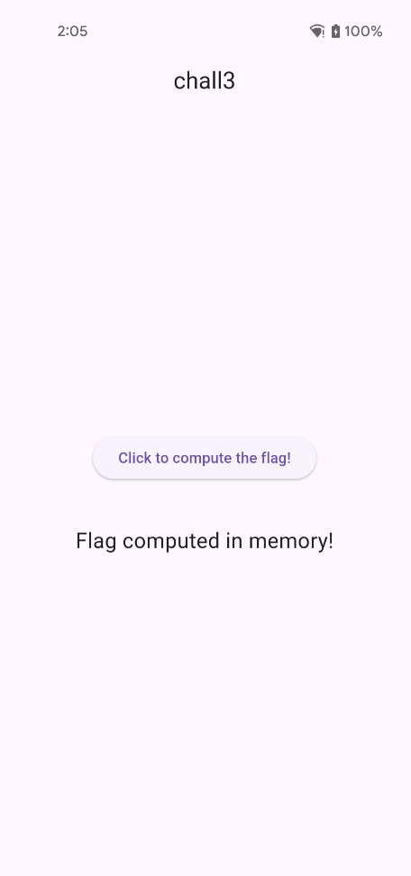
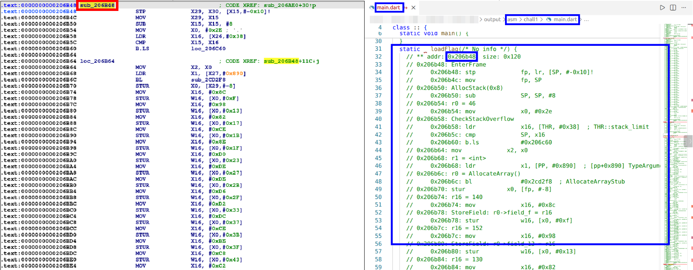
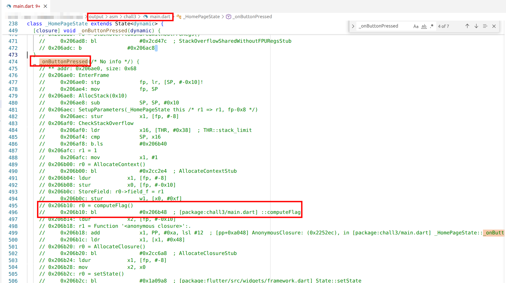
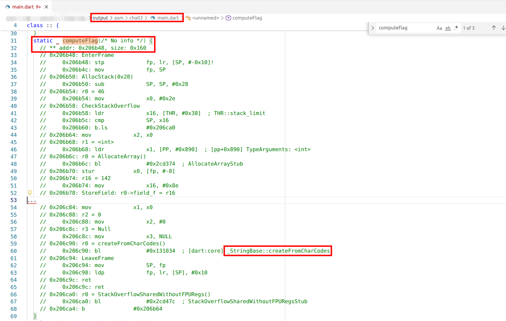
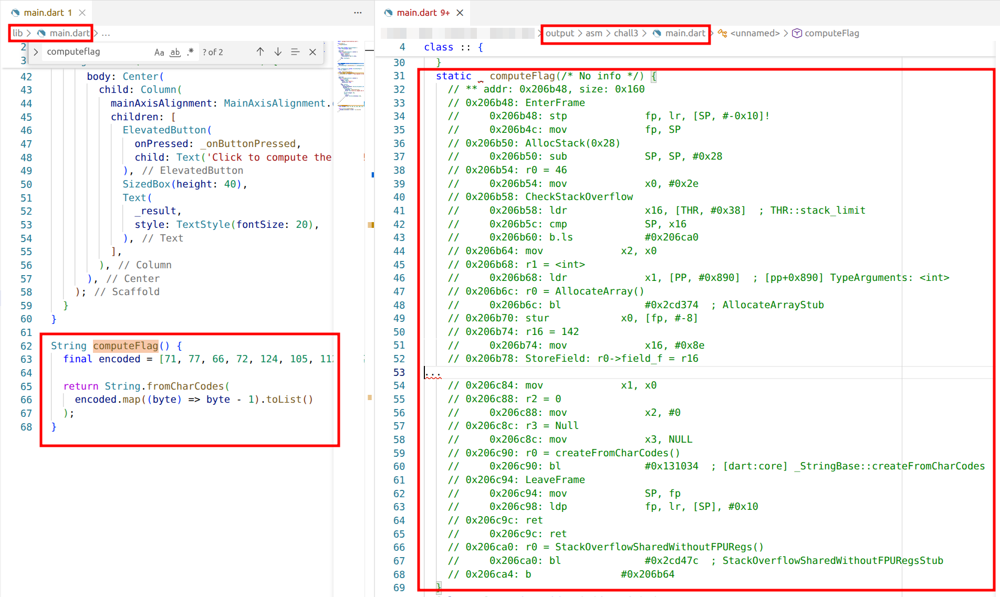

# Challenge 3: Release Mode - Hooking with Frida 1 (read return value)
## Overview

So you've opened up the app and you're greeted with a simple interface. There's a button that says "Click to compute the flag".


But here's where it gets interesting. After clicking the button, instead of showing you the flag, the app displays "Flag computed in memory". This is a big hint! It tells us that somewhere in the Dart code, there's a function that's processing the flag, but the app just isn't displaying it in the UI.



The goal here is to analyze the decompiled code to see how and where the flag is computed into memory, identify the function that handles it, and determine how it can be observed or intercepted using tools like Frida.

## Analysis
We need to reverse engineer this Flutter app. For this, we'll use Blutter, a tool that helps decompile Flutter applications.

### What to expect from Blutter
As explained in the previous solution, Blutter allows you to analyze and reverse the logic contained in `libapp.so`. 

To make this easier to visualize, imagine an example application with a function called `loadFlag`. The image below is meant as an introduction and highlights the difference between what IDA/Ghidra and Blutter produce when analyzing the same binary.

Suppose the `loadFlag` function resides at address `0x206b48`. At this address, there is indeed a valid function in the binary, but when viewed in IDA (left part) it appears only as an unnamed subroutine. IDA cannot recover the original function name and struggles to lift the logic into readable, high-level code, leaving you with low-level assembly that is difficult to reason about.

In contrast, when the same function is viewed from the Blutter output (right part), you can notice that the function name `loadFlag` is correctly recovered, the address matches what we saw in IDA, and helpful comments are added. This makes the function's behavior far easier to understand and analyze.



### Running Blutter
```shell
$ docker run --rm -v $(pwd):/data blutter /data/chall3.apk /data/output                      
...
[21/22] Building CXX object CMakeFiles/blutter_dartvm3.8.1_android_arm64.dir/src/CodeAnalyzer_arm64.cpp.o
[22/22] Linking CXX executable blutter_dartvm3.8.1_android_arm64
-- Install configuration: "Release"
-- Installing: /app/bin/blutter_dartvm3.8.1_android_arm64
libapp is loaded at 0x7a7cdce2d000
Dart heap at 0x7a7b00000000
Analyzing the application
Dumping Object Pool
Generating application assemblies
Generating Frida script
Dart version: 3.8.1, Snapshot: 830f4f59e7969c70b595182826435c19, Target: android arm64
flags: product no-code_comments no-dwarf_stack_traces_mode dedup_instructions no-tsan no-msan arm64 android compressed-pointers
```

### Finding our target
Now, when you're reverse engineering an app, it helps to start with something you already know. In this case, we know the button text says "Click to compute the flag", so let's search for that string in the decompiled output.


Bingo! We find several occurrences in `main.dart` and in the object pool (`pp.txt`). Since we're dealing with a button, the next logical step is to look for the button's `onPressed` handler, where we discover a reference to a function named `computeFlag`.



This function loads a hardcoded list of numeric values from the object pool, applies a mapping transformation to these values, and then converts the resulting character codes into a string using `createFromCharCodes`, ultimately returning a `String` that represents the computed flag.



The goal now is to intercept this function at runtime with Frida and capture its return value to reveal the flag string.

### Comparing Dart Code with Decompiled Output
If you compare the original Dart code structure with what Blutter gives you, you'll notice they're quite similar, but the decompiled version includes memory addresses and assembly-like instructions that we'll need for hooking.



## Why Hooking Flutter Apps is Tricky
Here's the thing about Flutter apps - they're not your typical Android apps. Flutter compiles Dart code into native code, which means traditional Android hooking approaches won't work out of the box. The Dart runtime has its own memory management, object model, and calling conventions.

This is why Blutter generates a file called `blutter_frida.js` that includes utility functions that understand how to:
- Parse Dart objects from memory;
- Handle Dart's tagged pointer system;
- Extract string values from Dart String objects;
- Deal with Dart's class system;

To hook the `computeFlag` function, we need its memory address. From the decompiled code, we can see the function is at offset `0x206b48` within the `libapp.so` library.

Below is the updated `blutter_frida.js` script. The only modifications are the updating of `ret_fn_addr` with the offset of `computeFlag` and the addition of the `onLeave` handler to capture and print the function's return value. All other parts of the script remain unchanged.

**File:** `blutter_frida.js`
```js
const ShowNullField = false;
const MaxDepth = 5;
var libapp = null;

function onLibappLoaded() {
    // HERE: edit function address
    const ret_fn_addr = 0x206b48;
    Interceptor.attach(libapp.add(ret_fn_addr), {
        onEnter: function () {
            init(this.context);
        },
        // HERE: add onLeave hook to print return value
        onLeave: function (retval) {
            try {
                const [tptr, cls, value] = getTaggedObjectValue(retval);
                if (cls.id === CidString || cls.id === CidTwoByteString) {
                    console.log(`1 RET ${cls.name}@${tptr.toString().slice(2)} = "${value}"`);
                } else {
                    console.log(`2 RET ${cls.name}@${tptr.toString().slice(2)} =`, value);
                }
            } catch (e) {
                console.error("Failed to parse return value:", e);
            }
        }
    });
}
...
```

Let's break down what's happening here:
- `onEnter`: Called when we're about to execute the function. We initialize the context so we can properly parse Dart objects;
- `onLeave`: Called when the function is returning;
    - retval contains the return value (our flag!);
    - we use `getTaggedObjectValue()` to parse the Dart object;
    - if it's a `String` object, we extract and print the actual string value;


Running the script:
```shell
$ frida -U -f com.flutter_labs.chall3 -l ./blutter_frida.js 
     ____
    / _  |   Frida 16.7.13 - A world-class dynamic instrumentation toolkit
   | (_| |
    > _  |   Commands:
   /_/ |_|       help      -> Displays the help system
   . . . .       object?   -> Display information about 'object'
   . . . .       exit/quit -> Exit
   . . . .
   . . . .   More info at https://frida.re/docs/home/
   . . . .
   . . . .   Connected to Pixel 4a (id=)
Spawned `com.flutter_labs.chall3`. Resuming main thread!                
[Pixel 4a::com.flutter_labs.chall3 ]-> 1 RET String@6f005700d9 = "FLAG{hooking_dart_code}"
```

## Flag
FLAG{hooking_dart_code}

---

# Deep Dive: Hooking with Frida in Flutter

Hooking Flutter applications with Frida is not straightforward. Unlike traditional native binaries, Flutter applications execute Dart code on top of a custom runtime that relies heavily on tagged pointers, object headers, and runtime metadata. As a result, simply intercepting a function call is not enough and you must also understand how Dart objects are represented and decoded at runtime.

For this reason, readers are strongly encouraged to have a look at Flutter's execution model and carefully review the helper routines inside `blutter_frida.js`. The Blutter project is open source, providing an excellent opportunity to explore how Dart internals can be instrumented with Frida.