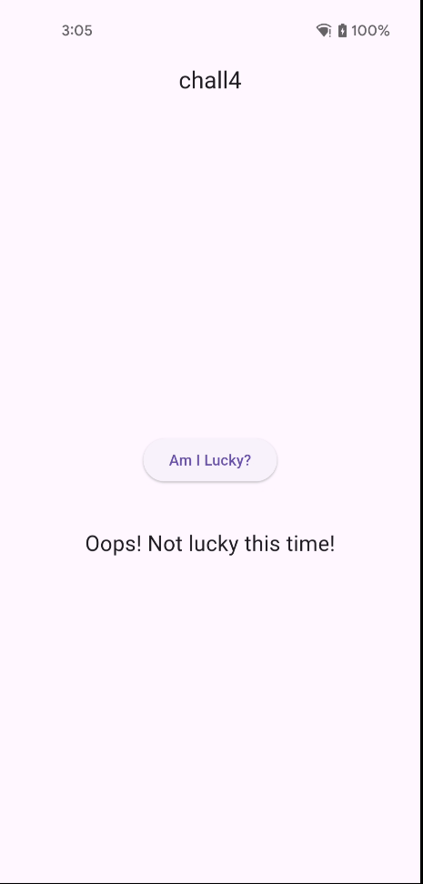
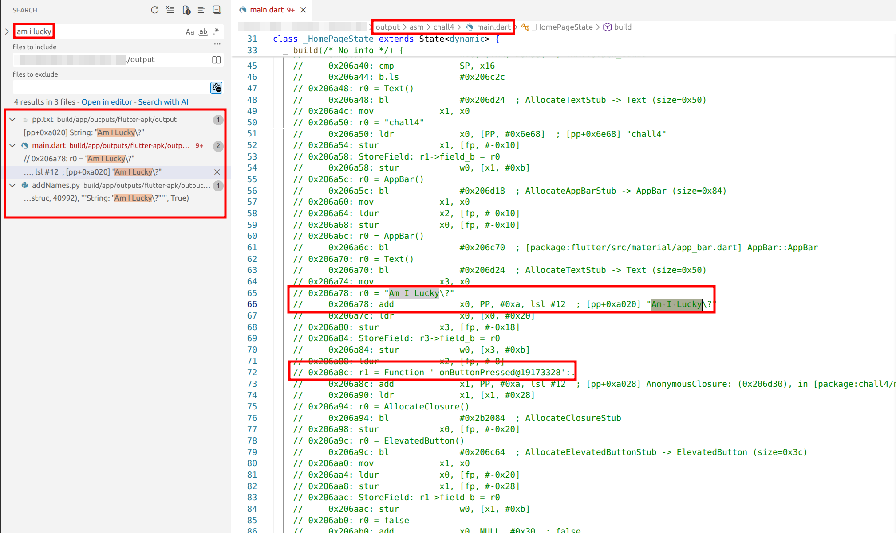
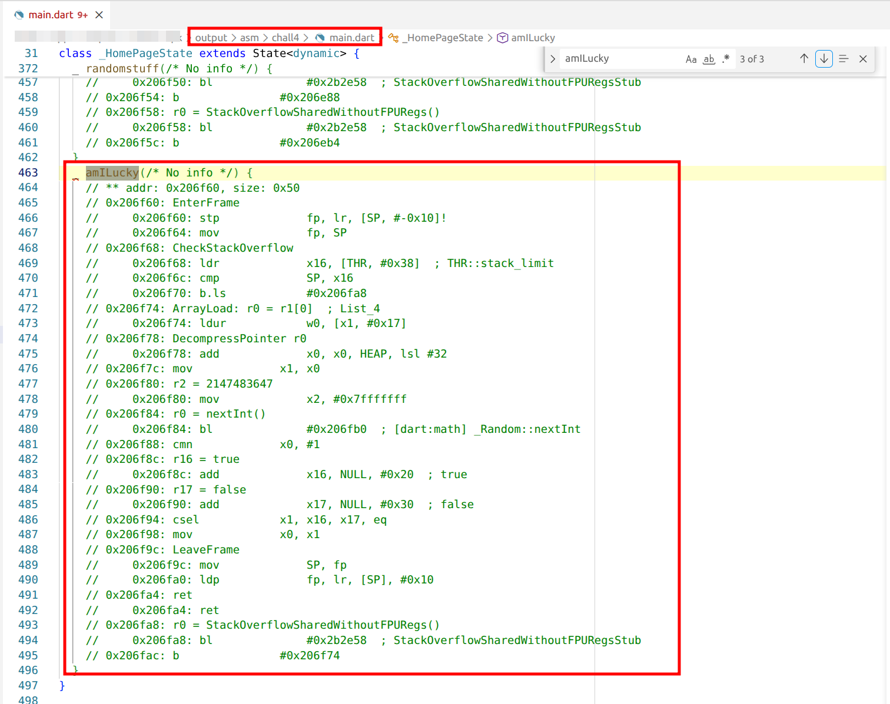

# Challenge 4: Release Mode - Hooking with Frida 2 (change return value)
## Overview

Welcome back! In this challenge, we'll explore a Flutter application built in release mode. Upon launching the application, you are presented with a button: "Am I Lucky?"


After clicking the button, the app displays "Oops! Not lucky this time!". Judging by the button text, it looks like there's a boolean condition behind the scenes determining whether you get "lucky" or "unlucky".



The goal here is to analyze the decompiled code to understand where and how the flag is generated, identify the function responsible for handling it, and figure out how to hook that function using tools like Frida.

## Analysis
We need to reverse engineer this Flutter app. For this, we'll use Blutter, a tool that helps decompile Flutter applications.

### Running Blutter
```shell
$ docker run --rm -v $(pwd):/data blutter /data/chall4.apk /data/output                      
...
[21/22] Building CXX object CMakeFiles/blutter_dartvm3.8.1_android_arm64.dir/src/CodeAnalyzer_arm64.cpp.o
[22/22] Linking CXX executable blutter_dartvm3.8.1_android_arm64
-- Install configuration: "Release"
-- Installing: /app/bin/blutter_dartvm3.8.1_android_arm64
libapp is loaded at 0x7cd9bac4a000
Dart heap at 0x7cd800000000
Analyzing the application
Dumping Object Pool
Generating application assemblies
Generating Frida script
Dart version: 3.8.1, Snapshot: 830f4f59e7969c70b595182826435c19, Target: android arm64
flags: product no-code_comments no-dwarf_stack_traces_mode dedup_instructions no-tsan no-msan arm64 android compressed-pointers
```

### Finding our target
The following steps are largely the same as in the previous challenge: you start by searching for something you already recognize, then iteratively follow the code flow from there.

Let's start by searching for the button's text in the decompiled output.



We find several occurrences in `main.dart` and in the object pool (`pp.txt`). Since we're dealing with a button, the next logical step is to look for the button's `onPressed` handler, where we discover a reference to a function named `amILucky`.


At a high level, this function retrieves a `Random` object, generates a random integer (line 480), and then converts the result into a boolean value.



More specifically, the function starts by setting up a stack frame and performing a stack overflow check, which is standard for Dart AOT–compiled functions. It then loads the first element from a list passed as an argument; this element is a `Random` instance. Using that object, it calls `nextInt(2147483647)` (the equivalent of `0x7fffffff`), which generates a random integer in the range allowed by Dart's Random.

After the random number is generated, the code compares the result in a way that effectively checks whether the returned value equals `-1` with `cmn x0, #1` (compare negative: check if `x0+1` is equal to `0`). Based on this comparison, it selects either `true` (`NULL + 0x20`) or `false` (`NULL + 0x30`) using a conditional select instruction and returns that boolean value to the caller.

The goal now is to intercept this function at runtime with Frida and change its return value from `false` to `true`.

### Comparing Dart Code with Decompiled Output
If you compare the original Dart code structure with what Blutter gives you, you'll notice they're quite similar, but the decompiled version includes memory addresses and assembly-like instructions that we'll need for hooking.


## Hooking Return Value
To hook the `amILucky` function, we need its memory address. From the decompiled code, we can see the function is at offset `0x206f60` within the `libapp.so` library.

Below is the updated `blutter_frida.js` script. The only modifications are the updating of `ret_fn_addr` with the offset of `amILucky` and the addition of the `onLeave` handler to capture and change the function's return value. All other parts of the script remain unchanged.

**File:** `blutter_frida.js`
```js
const ShowNullField = false;
const MaxDepth = 5;
var libapp = null;

function onLibappLoaded() {
    // HERE: offset of amILucky
    const fn_addr = 0x206f60;

    Interceptor.attach(libapp.add(fn_addr), {
        onEnter: function () {
            init(this.context);
        },

        onLeave: function (retval) {
            // HERE: booleans in flutter, look at asm if in doubt
            // Dart true = NULL + 0x20
            // Dart false = NULL + 0x30
            const dartTrue = this.context[NullReg].add(0x20);
            retval.replace(dartTrue);

            console.log("[+] amILucky() forced to return TRUE");
        }
    });
}
...
```

Running the script:
```shell
$ frida -U -f com.flutter_labs.chall4 -l ./blutter_frida.js 
     ____
    / _  |   Frida 16.7.13 - A world-class dynamic instrumentation toolkit
   | (_| |
    > _  |   Commands:
   /_/ |_|       help      -> Displays the help system
   . . . .       object?   -> Display information about 'object'
   . . . .       exit/quit -> Exit
   . . . .
   . . . .   More info at https://frida.re/docs/home/
   . . . .
   . . . .   Connected to Pixel 4a (id=)
Spawned `com.flutter_labs.chall4`. Resuming main thread!                
[Pixel 4a::com.flutter_labs.chall4 ]-> [+] amILucky() forced to return TRUE
```

Screenshot:


## Flag
FLAG{hooking_return_value}
