# Challenge 5: Release Mode - Reversing Platform (Java) Code
## Overview

Welcome back! In this challenge, we'll dive into integrating Android code within a Flutter application built in release mode. Upon launching the application, you are greeted with a simple welcome screen displaying the message: "Sorry, this device is rooted! Checked with Platform (Java/Kotlin) RootBeer"

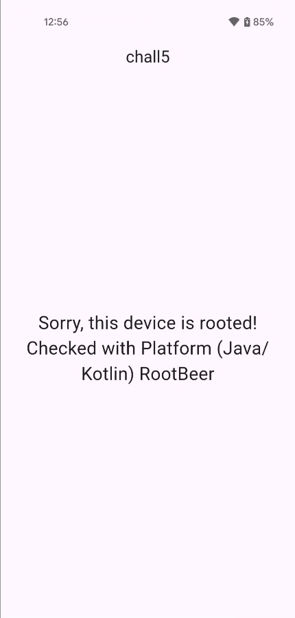

Before we step into, let's set the stage with some context about Flutter's architecture. A Flutter project contains several folders, with Dart code acting as a bridge between your business logic and the Android platform code.

But developers can also embed platform code directly into their Flutter apps using Java/Kotlin for Android and Swift/Objective-C for iOS.

## Analysis
First, let's confirm that this app was built in release mode. You can use `apktool` to decode the app and check its configuration.
```shell
$ apktool d chall5.apk
I: Using Apktool 2.8.1 on chall5.apk
I: Loading resource table...
I: Decoding AndroidManifest.xml with resources...
I: Loading resource table from file: /home/bruno/.local/share/apktool/framework/1.apk
I: Regular manifest package...
I: Decoding file-resources...
I: Decoding values */* XMLs...
I: Baksmaling classes.dex...
I: Copying assets and libs...
I: Copying unknown files...
I: Copying original files...
I: Copying META-INF/services directory

$ find ./chall5 -name "kernel_blob.bin"

$ find ./chall5 -name "libapp.so"      
./chall5/lib/arm64-v8a/libapp.so
./chall5/lib/armeabi-v7a/libapp.so
./chall5/lib/x86_64/libapp.so
```

The approach here is to first analyze the application from the Flutter side, even though the app itself hints that the root check is performed in platform code and could be inspected with tools like JADX. Starting with Flutter allows to understand the overall flow, see how the call is triggered, and identify where the result is used in the Dart code before diving into the platform implementation.

### How Flutter Compiles Platform Code
The Java or Kotlin code doesn't get compiled into Dart and it stays as standard Android bytecode inside the APK or AAB, usually in the `classes.dex` files, just like any normal Android app. 

Flutter communicates with this code through platform channels, which act as a message-passing bridge. When Dart calls something like `MethodChannel.invokeMethod`, the call is packaged into a message, sent to the platform side, executed there, and the result is sent back asynchronously.

So, in essence, Dart is AOT-compiled into machine code for speed, the platform Java/Kotlin code remains bytecode, and platform channels are the glue connecting the two. Even in release builds, the Java/Kotlin code is fully accessible (e.g., via JADX).


### Analyzing with Blutter
Let's fire up Blutter and take a look inside the app.
```shell
$ docker run --rm -v $(pwd):/data blutter /data/chall5.apk /data/output
...
[21/22] Building CXX object CMakeFiles/blutter_dartvm3.8.1_android_arm64.dir/src/CodeAnalyzer_arm64.cpp.o
[22/22] Linking CXX executable blutter_dartvm3.8.1_android_arm64
-- Install configuration: "Release"
-- Installing: /app/bin/blutter_dartvm3.8.1_android_arm64
libapp is loaded at 0x7575410c7000
Dart heap at 0x757400000000
Analyzing the application
Dumping Object Pool
Generating application assemblies
Generating Frida script
Dart version: 3.8.1, Snapshot: 830f4f59e7969c70b595182826435c19, Target: android arm64
flags: product no-code_comments no-dwarf_stack_traces_mode dedup_instructions no-tsan no-msan arm64 android compressed-pointers
```

When the Flutter app starts, the root check is triggered immediately inside `initState()`. This method is called as soon as the widget is created, before anything is rendered on screen. Inside `initState()`, the app calls the function `_checkRoot` whose only job is to ask the system whether the device is rooted. This means the root detection happens automatically at startup, without any user interaction, and the result will directly influence what the app shows next.

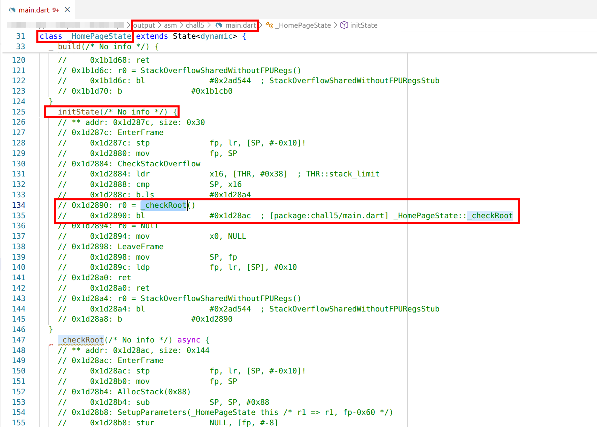

Flutter itself cannot perform low-level system checks like root detection, so it relies on platform code to do that work. This is handled through a `MethodChannel`, which is Flutter's bridge between Dart and the underlying platform (Android or iOS). From the Dart side, the code calls `MethodChannel.invokeMethod`, passing a string such as `isRooted`. 

That string is important, because it's the key used on the platform side to decide which function to execute. When you're reversing or analyzing this kind of app, the `invokeMethod` in `platform_channel.dart` is exactly the method you want to look for, along with the method name being passed. The actual root check logic lives entirely in platform code and returns a value back to Dart asynchronously.

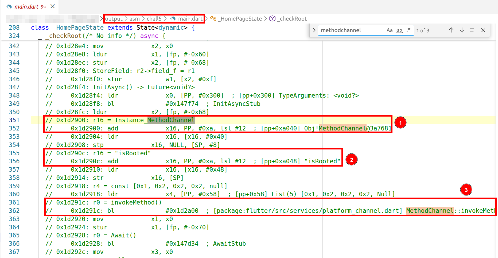

Once the platform code finishes, execution resumes in Dart after the await. At this point, the app receives a boolean value that represents the result of the root check. The returned boolean is tested, and based on its value the app either shows a fixed message saying the device is rooted, or it generates and displays the flag using a helper function. 

Even though the root detection happens in Java/Kotlin, the choice of what the user sees is made right here in Dart, with a simple `if` that branches depending on the platform result.

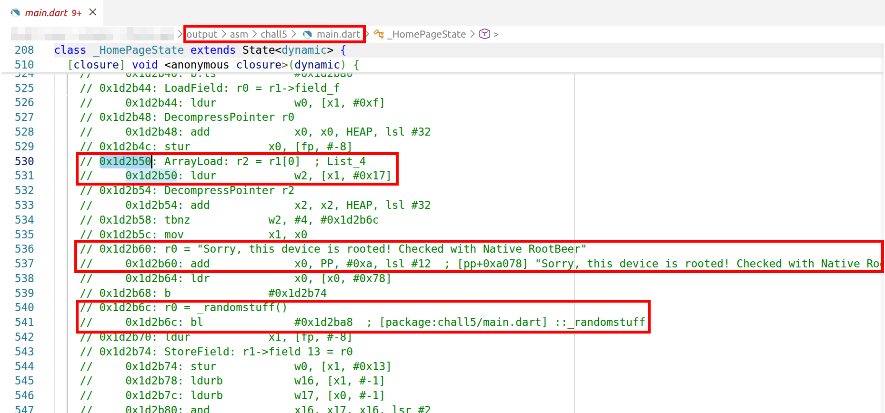

### Analyzing with JADX
Let's fire up JADX and see what we're dealing with. JADX is a dex-to-java decompiler that lets you browse and decompile Android APK files.

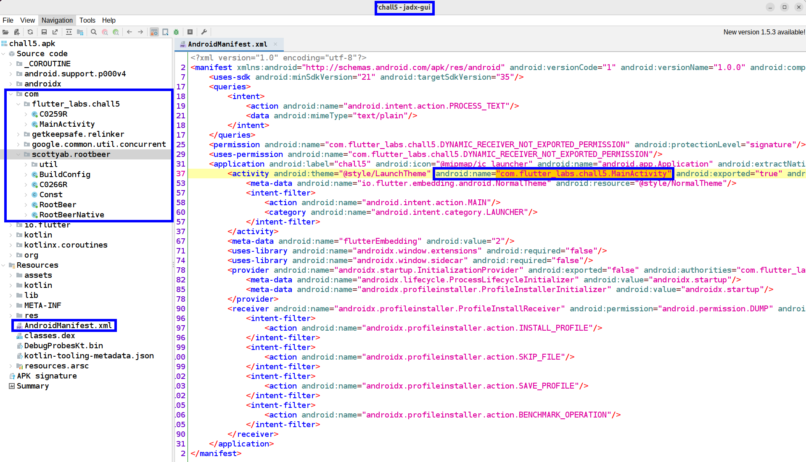

First, let's examine the manifest. The entry point of the app is `com.flutter_labs.chall5.MainActivity`. Note that several indicators confirm that this is a Flutter application: for example, references like `io.flutter.embedding.android.NormalTheme` in the manifest point to Flutter, and the presence of native libraries such as `libapp.so` and `libflutter.so` further supports this.

**File:** `AndroidManifest.xml`
```xml
<?xml version="1.0" encoding="utf-8"?>
<manifest xmlns:android="http://schemas.android.com/apk/res/android" android:versionCode="1" android:versionName="1.0.0" android:compileSdkVersion="35" android:compileSdkVersionCodename="15" package="com.flutter_labs.chall5" platformBuildVersionCode="35" platformBuildVersionName="15">
    <uses-sdk android:minSdkVersion="21" android:targetSdkVersion="35"/>
    <queries>
        <intent>
            <action android:name="android.intent.action.PROCESS_TEXT"/>
            <data android:mimeType="text/plain"/>
        </intent>
    </queries>
    <permission android:name="com.flutter_labs.chall5.DYNAMIC_RECEIVER_NOT_EXPORTED_PERMISSION" android:protectionLevel="signature"/>
    <uses-permission android:name="com.flutter_labs.chall5.DYNAMIC_RECEIVER_NOT_EXPORTED_PERMISSION"/>
    <application android:label="chall5" android:icon="@mipmap/ic_launcher" android:name="android.app.Application" android:extractNativeLibs="true" android:appComponentFactory="androidx.core.app.CoreComponentFactory">
        <activity android:theme="@style/LaunchTheme" android:name="com.flutter_labs.chall5.MainActivity" android:exported="true" android:taskAffinity="" android:launchMode="singleTop" android:configChanges="fontScale|layoutDirection|density|smallestScreenSize|screenSize|uiMode|screenLayout|orientation|keyboardHidden|keyboard|locale" android:windowSoftInputMode="adjustResize" android:hardwareAccelerated="true">
            <meta-data android:name="io.flutter.embedding.android.NormalTheme" android:resource="@style/NormalTheme"/>
            <intent-filter>
                <action android:name="android.intent.action.MAIN"/>
                <category android:name="android.intent.category.LAUNCHER"/>
            </intent-filter>
        </activity>
        <meta-data android:name="flutterEmbedding" android:value="2"/>
        <uses-library android:name="androidx.window.extensions" android:required="false"/>
        <uses-library android:name="androidx.window.sidecar" android:required="false"/>
        <provider android:name="androidx.startup.InitializationProvider" android:exported="false" android:authorities="com.flutter_labs.chall5.androidx-startup">
            <meta-data android:name="androidx.lifecycle.ProcessLifecycleInitializer" android:value="androidx.startup"/>
            <meta-data android:name="androidx.profileinstaller.ProfileInstallerInitializer" android:value="androidx.startup"/>
        </provider>
        <receiver android:name="androidx.profileinstaller.ProfileInstallReceiver" android:permission="android.permission.DUMP" android:enabled="true" android:exported="true" android:directBootAware="false">
            <intent-filter>
                <action android:name="androidx.profileinstaller.action.INSTALL_PROFILE"/>
            </intent-filter>
            <intent-filter>
                <action android:name="androidx.profileinstaller.action.SKIP_FILE"/>
            </intent-filter>
            <intent-filter>
                <action android:name="androidx.profileinstaller.action.SAVE_PROFILE"/>
            </intent-filter>
            <intent-filter>
                <action android:name="androidx.profileinstaller.action.BENCHMARK_OPERATION"/>
            </intent-filter>
        </receiver>
    </application>
</manifest>
```

Second, let's examine the main entry point of the app. The app is using a `MethodChannel` called `root_check_channel` to communicate between Dart and Java code. When the Dart side calls the `isRooted` method, it triggers `RootBeer.isRooted()` on the Java side.

**File:** `MainActivity.java`
```java
package com.flutter_labs.chall5;

import com.scottyab.rootbeer.RootBeer;
import io.flutter.embedding.android.FlutterActivity;
import io.flutter.embedding.engine.FlutterEngine;
import io.flutter.plugin.common.MethodCall;
import io.flutter.plugin.common.MethodChannel;

/* loaded from: classes.dex */
public class MainActivity extends FlutterActivity {
    private static final String CHANNEL = "root_check_channel";

    @Override // io.flutter.embedding.android.FlutterActivity, io.flutter.embedding.android.FlutterActivityAndFragmentDelegate.Host, io.flutter.embedding.android.FlutterEngineConfigurator
    public void configureFlutterEngine(FlutterEngine flutterEngine) {
        super.configureFlutterEngine(flutterEngine);
        new MethodChannel(flutterEngine.getDartExecutor().getBinaryMessenger(), CHANNEL).setMethodCallHandler(new MethodChannel.MethodCallHandler() { // from class: com.flutter_labs.chall5.MainActivity$$ExternalSyntheticLambda0
            @Override // io.flutter.plugin.common.MethodChannel.MethodCallHandler
            public final void onMethodCall(MethodCall methodCall, MethodChannel.Result result) {
                MainActivity.this.m236xc9298c47(methodCall, result);
            }
        });
    }

    /* JADX INFO: Access modifiers changed from: package-private */
    /* renamed from: lambda$configureFlutterEngine$0$com-flutter_labs-chall5-MainActivity */
    public /* synthetic */ void m236xc9298c47(MethodCall methodCall, MethodChannel.Result result) {
        if (methodCall.method.equals("isRooted")) {
            result.success(Boolean.valueOf(new RootBeer(this).isRooted()));
        } else {
            result.notImplemented();
        }
    }
}
```

Next, let's examine the implementation of the `RootBeer.isRooted()` method by double-clicking on the method in JADX. This method performs several checks, including detecting root management apps (such as SuperSU or Magisk Manager), searching for the `su` binary, inspecting system properties, and looking for paths that should be read-only but are writable. If any of these checks return `true`, the device is considered rooted.

**File:** `RootBeer.java`
```java
package com.scottyab.rootbeer;
...

/* loaded from: classes.dex */
public class RootBeer {
    private boolean loggingEnabled = true;
    private final Context mContext;

    public RootBeer(Context context) {
        this.mContext = context;
    }

    public boolean isRooted() {
        return detectRootManagementApps() || detectPotentiallyDangerousApps() || checkForBinary("su") || checkForDangerousProps() || checkForRWPaths() || detectTestKeys() || checkSuExists() || checkForRootNative() || checkForMagiskBinary();
    }
...
```

### Bypassing with Frida
Frida is a dynamic instrumentation toolkit that lets you inject JavaScript into applications. We can use it to hook the `RootBeer.isRooted()` method and force it to always return `false`, regardless of whether the device is actually rooted.

**File:** `bypass.js`
```js
Java.perform(function () {
    var RootBeer = Java.use("com.scottyab.rootbeer.RootBeer");

    RootBeer.isRooted.implementation = function () {
        console.log("[+] RootBeer.isRooted() called. Changing return value to 'false'");
        return false;
    };
});
```

Let's run it:
```shell
$ frida -U -f com.flutter_labs.chall5 -l ./bypass.js
     ____
    / _  |   Frida 16.7.13 - A world-class dynamic instrumentation toolkit
   | (_| |
    > _  |   Commands:
   /_/ |_|       help      -> Displays the help system
   . . . .       object?   -> Display information about 'object'
   . . . .       exit/quit -> Exit
   . . . .
   . . . .   More info at https://frida.re/docs/home/
   . . . .
   . . . .   Connected to Pixel 4a (id=)
Spawned `com.flutter_labs.chall5`. Resuming main thread!                
[Pixel 4a::com.flutter_labs.chall5 ]-> [+] RootBeer.isRooted() called. Changing return value to 'false'
```

This shows that even though the app is built with Flutter, the root check is executed in the Android layer. As mentioned before, Flutter communicates with platform-specific code through platform channels, and the Dart code simply requests the root status from the Android side. The hooked result with Frida is then sent back to Flutter, bypassing the protection. **This shows that Flutter apps still rely on and inherit the attack surface of platform code.** 

The hook triggered, and now the app shows us the flag:


## Flag
FLAG{hooking_platform_code}

---

# Deep Dive: Platform Code Obfuscation
It's worth mentioning that this challenge was built with Android code obfuscation (like R8/ProGuard) disabled to make the reverse engineering process easier for learning purposes. In real-world Flutter apps, R8 minification and obfuscation are typically enabled by default in release builds, which would make class and method names much harder to read.

At this point, let's rebuild the application without the disabling parameters (`isMinifyEnabled = false`,`isShrinkResources = false`) so that the protection is enabled again. Let's try to retrieve the flag once more.

## Analysis with JADX
The application entry point is defined in the `AndroidManifest.xml` file, where the `MainActivity` is specified as the launcher activity.

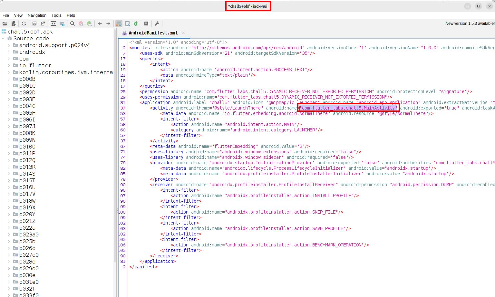

The `MainActivity` acts as the bridge between Flutter and Android code. It initializes the Flutter engine and registers the platform channel used by the Dart layer to invoke platform methods.

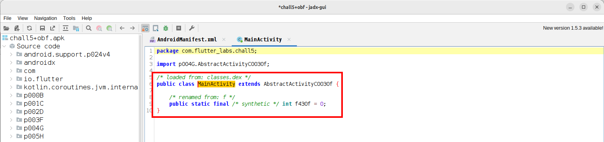

By searching for the `isRooted` string (obtained using Blutter, as shown in the previous section), we can trace how the Flutter method call is routed through the platform channel and handled in the Android code.

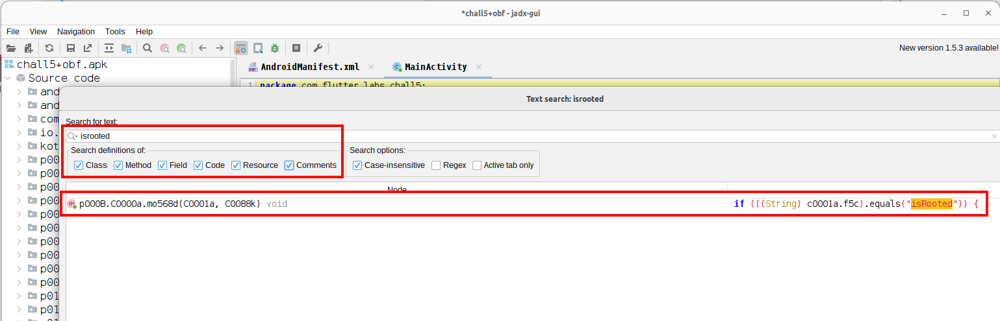
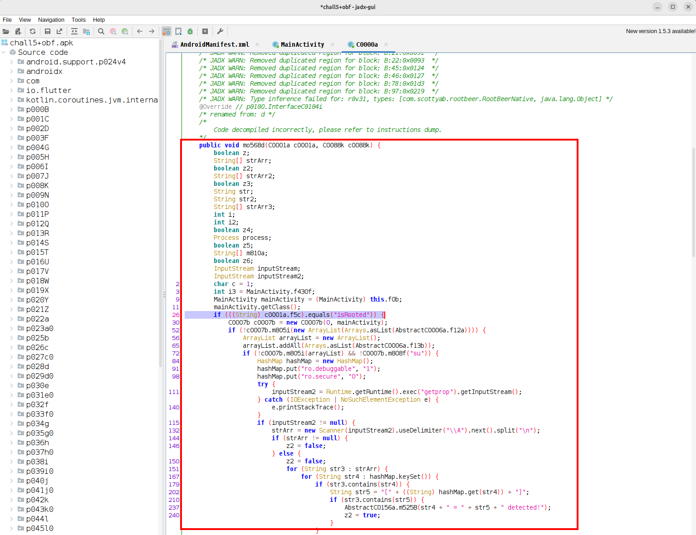

The method `mo568d` acts as a dispatcher for platform-channel calls. It checks the method name received from Flutter and executes the corresponding Java logic when the method name is `isRooted`.

*The comments in the following snippets are provided to guide through the code and clarify each step of the method.*

**File:** `p000B.C0000a`
```java
    public void mo568d(C0001a c0001a, C0088k c0088k) {
        boolean z;
        String[] strArr;
        boolean z2;
        String[] strArr2;
        boolean z3;
        String str;
        String str2;
        String[] strArr3;
        int i;
        int i2;
        boolean z4;
        Process process;
        boolean z5;
        String[] m810a;
        boolean z6;
        InputStream inputStream;
        InputStream inputStream2;
        char c = 1;
        int i3 = MainActivity.f430f;
        MainActivity mainActivity = (MainActivity) this.f0b;
        mainActivity.getClass();

        // check if the method name equals 'isRooted'
        if (((String) c0001a.f5c).equals("isRooted")) {
            // root detection logic
            ...
        }
        // otherwise method not handled
        c0088k.m582b();
    }
}
```

Inside the `isRooted` branch, the function performs multiple root-detection checks sequentially, updating boolean flags to track whether any check indicates a rooted device.

**File:** `p000B.C0000a`
```java
package p000B;
...
public final /* synthetic */ class C0000a implements InterfaceC0104i, InterfaceC0097b {
...
    public void mo568d(C0001a c0001a, C0088k c0088k) {
        // boolean variables for saving the state of the root check (true=rooted, false=not rooted)
        boolean z;
        boolean z2;
        boolean z3;
        boolean z4;
        boolean z5;
        boolean z6;
...
if (((String) c0001a.f5c).equals("isRooted")) {
            C0007b c0007b = new C0007b(0, mainActivity);
            
            // CHECK: search for root binaries in common paths
            // f12a = {"com.noshufou.android.su", "com.noshufou.android.su.elite", ..., "com.alephzain.framaroot"};
            // if no binaries are found, proceed
            if (!c0007b.m805i(new ArrayList(Arrays.asList(AbstractC0006a.f12a)))) {
                ArrayList arrayList = new ArrayList();
                
                // CHECK: search for additional root binaries
                // f13b = {"com.koushikdutta.rommanager", ..., "catch_.me_.if_.you_.can_"};
                arrayList.addAll(Arrays.asList(AbstractC0006a.f13b));

                // CHECK: search if "su" binary exists in PATH
                if (!c0007b.m805i(arrayList) && !C0007b.m808f("su")) {

                    // CHECK: look for dangerous build properties
                    HashMap hashMap = new HashMap();
                    hashMap.put("ro.debuggable", "1");
                    hashMap.put("ro.secure", "0");

                    // execute "getprop" command to get all system properties
                    try {
                        inputStream2 = Runtime.getRuntime().exec("getprop").getInputStream();
                    } catch (IOException | NoSuchElementException e) {
                        e.printStackTrace();
                    }

                    // if we got inputStream2, read it and parse the properties
                    // here z2 keeps the state of the detection. false=not_rooted, true=rooted
                    if (inputStream2 != null) {
                        strArr = new Scanner(inputStream2).useDelimiter("\\A").next().split("\n");
                        if (strArr != null) {
                            z2 = false;
                        } else {
                            z2 = false;

                            // iterate over properties
                            for (String str3 : strArr) {
                                ...

                        // only continue if no dangerous properties were found (z2=false)
                        if (!z2) {

                            // CHECK: mount permission check
                            // execute "mount" command to see all mounted filesystems
                            try {
                                inputStream = Runtime.getRuntime().exec("mount").getInputStream();
                            } catch (IOException | NoSuchElementException e2) {
                                e2.printStackTrace();
                            }

                            // z3 serves the same purpose of z2, if dangerous permissions are found, set to true=rooted, false otherwise
                            if (inputStream != null) {
                                strArr2 = new Scanner(inputStream).useDelimiter("\\A").next().split("\n");
                                if (strArr2 != null) {
                                    z3 = false;
                                } else {
                                    int i4 = Build.VERSION.SDK_INT;    
                                ...

                                // only continue if no dangerous mount were found (z3=false)
                                if (!z3) {

                                    // CHECK: build tags check
                                    // again z4 serves as the root detection state
                                    String str8 = Build.TAGS;
                                    if (str8 != null && str8.contains("test-keys")) {
                                        z4 = true;
                                    } else {
                                        z4 = false;
                                    }

                                    // only continue if no dangerous build tags were found (z4=false)
                                    if (!z4) {

                                        // CHECK: find "su" binaries
                                        try {
                                            process = Runtime.getRuntime().exec(new String[]{"which", "su"});
                                        ...

                                        // only continue if no "su" binaries were found (z5=false)
                                        if (!z5) {

                                            // CHECK: native library root check
                                            if (!RootBeerNative.f431a) {
                                                ...

                                            // only continue if native checks didn't find root (z6=false)
                                            // CHECK: magisk detection
                                            if (!z6 && !C0007b.m808f("magisk")) {

                                                // IMPORTANT: [1]
                                                // if any of the previous checks failed, set boolean variable z as false=not_rooted and return
                                                z = false;
                                                c0088k.m581c(Boolean.valueOf(z));
                                                return;
                                            }

                                            // otherwise set to true=rooted and return
                                            z = true;
                                            c0088k.m581c(Boolean.valueOf(z));
                                            return;
                                        }
                                    ...
            // if any early check detected root, return true=rooted
            z = true;
            c0088k.m581c(Boolean.valueOf(z));
            return;
        }
        // otherwise method not handled
        c0088k.m582b();
    }
}
```

In `[1]`, that is the only code path where the function explicitly returns `false`, meaning the device is classified as not rooted. This happens only if all previous root-detection checks fail.

We do not need to understand the internal implementation of `c0088k.m581c`. What matters here is that this is the method used to return the final root detection result to Flutter, making it the ideal hook point for Frida. 

The screenshot highlights the obfuscated class name `N.k` and its method `c`, which are the only identifiers we need in order to hook the root detection result with Frida.

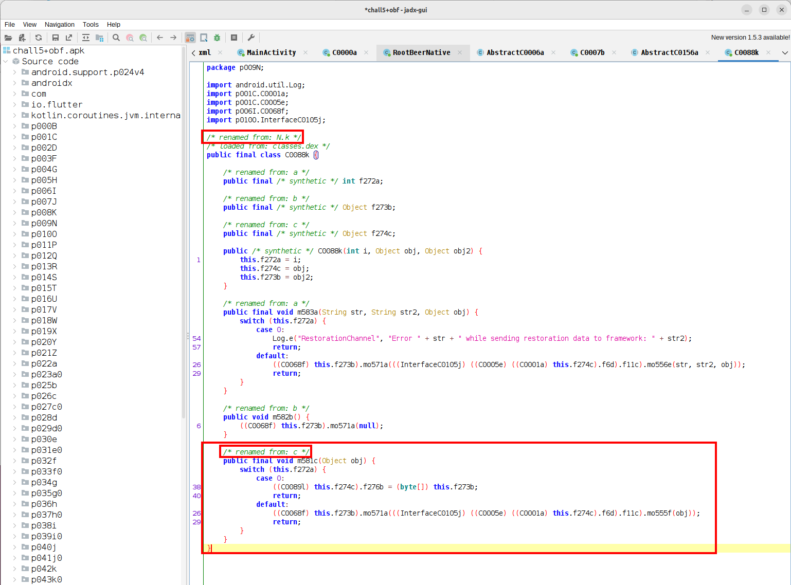


The Frida script hooks the callback method responsible for returning the root status. If the value indicates the device is rooted, it forces the result to `false` before it reaches the Flutter layer.

**File:** `bypass+obf.js`
```js
Java.perform(function () {
    console.log("[*] Initializing root detection bypass...");

    const Class = Java.use("N.k");
    const BooleanClass = Java.use("java.lang.Boolean");

    // hook the callback handler responsible for delivering the root check result
    // "Class.c" is the equivalent of "p000B.C0000a.mo568d" in JADX 
    Class.c.implementation = function (value) {

        // print argument
        console.log("[*] Callback invoked with value: " + value);

        // call from jadx is "c0088k.m581c(Boolean.valueOf(z));"
        // 1. check if value is a Boolean
        if (value !== null && value.getClass().getName() === "java.lang.Boolean") {
            
            // 2. cast value
            const isRooted = Java.cast(value, BooleanClass).booleanValue();
            console.log("[*] Root check returned: " + isRooted);

            // 3. if isRooted is true, force to false
            if (isRooted === true) {
                console.log("[!] Root detected; overriding value to false");
                return this.c(BooleanClass.valueOf(false));
            }
        }

        // 4. for all other values do nothing
        return this.c(value);
    };

    console.log("[+] Root detection bypassed successfully");
});
```

The Frida output confirms that the callback is invoked with `true` (root detected), and the hook successfully overrides it to `false`, bypassing the root detection logic.
```shell
$ frida -U -f com.flutter_labs.chall5 -l ./bypass+obf.js
     ____
    / _  |   Frida 16.7.13 - A world-class dynamic instrumentation toolkit
   | (_| |
    > _  |   Commands:
   /_/ |_|       help      -> Displays the help system
   . . . .       object?   -> Display information about 'object'
   . . . .       exit/quit -> Exit
   . . . .
   . . . .   More info at https://frida.re/docs/home/
   . . . .
   . . . .   Connected to Pixel 4a (id=)
Spawned `com.flutter_labs.chall5`. Resuming main thread!                
[Pixel 4a::com.flutter_labs.chall5 ]-> [*] Initializing root detection bypass...
[+] Root detection bypassed successfully
[*] Callback invoked with value: {}
[*] Callback invoked with value: null
[*] Callback invoked with value: null
[*] Callback invoked with value: null
[*] Callback invoked with value: true
[*] Root check returned: true
[!] Root detected; overriding value to false
[*] Callback invoked with value: null
[*] Callback invoked with value: null
[*] Callback invoked with value: null
```

Screenshot:

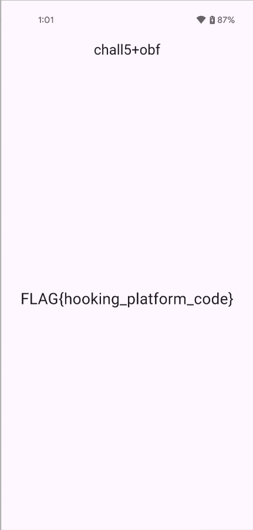