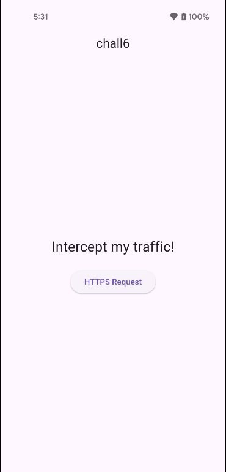
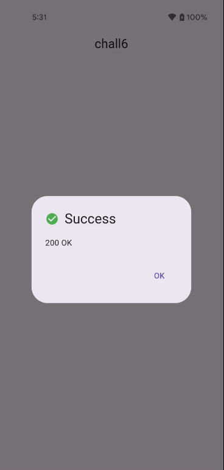
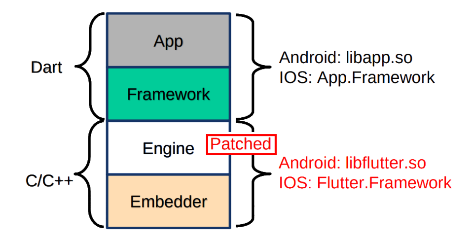
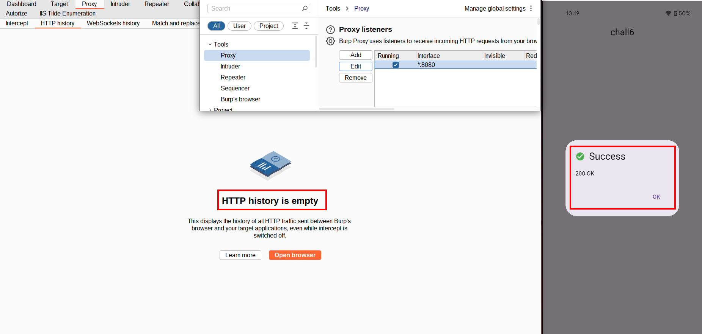
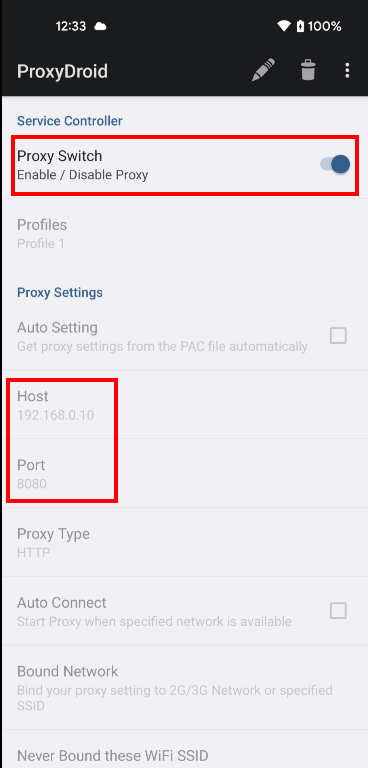

# Challenge 6: Release Mode - Intercepting HTTPS Traffic
## Overview
Welcome to Challenge 6! This challenge introduces network traffic interception in Flutter applications, a scenario that often frustrates security engineers encountering Flutter for the first time. Upon launching the app, you're presented with a simple interface displaying the message "Intercept my traffic!" with a button to make a network request.



Clicking the button triggers an HTTPS request and displays a success message indicating the request completed with a `200 OK` status code. However, the actual response content isn't shown in the UI.



The goal of this challenge is to intercept that network request, inspect the transmitted data, and ultimately extract the flag returned by the server.

## Analysis
In Android applications, intercepting HTTP traffic often works like this:
- Configure the device to use a proxy (e.g., Burp Suite); 
- Install the proxy's CA certificate in the system trust store;
- Trigger an HTTP/S request;
- Inspect the traffic;

However, this conventional approach doesn't work with Flutter apps.

### Why Flutter Breaks the Rules

Flutter does not use Android's networking stack. Instead, all HTTP traffic is handled by Dart's own runtime via the `dart:io` library, ensuring consistent behavior across all platforms (Android, iOS, web, desktop).

Flutter networking libraries like `http` and `dio` create direct TCP/IP socket connections through the Dart VM. These connections completely bypass Android's proxy configuration and certificate store. From the operating system's perspective, the traffic appears as raw network connections, leaving no opportunity for system-level proxies or MITM tools to intercept it automatically.

Even if you manage to route Flutter traffic through a proxy, Flutter's TLS implementation presents another obstacle. The Dart VM includes its own TLS/SSL stack that validates certificates independently of the Android system's certificate store. This means that simply installing a custom CA certificate in Android's trusted certificate store (as you would for intercepting native app traffic) won't work and Flutter won't trust your proxy's certificate by default.


## ReFlutter
ReFlutter is a framework designed specifically for reverse engineering Flutter applications. It modifies the Flutter engine and runtime inside a target APK to:
- Patch networking functions to make them proxy-aware;
- Patch TLS/SSL certificate validation to accept MITM certificates;
- Enable runtime introspection capabilities such as class and function dumps (generating a `dump.dart` file containing metadata and offsets of code executed during runtime)

**Note:** ReFlutter's `dump.dart` uses dynamic analysis, capturing only code paths that execute during your testing session. For comprehensive static analysis that extracts all code from `libapp.so` use Blutter, which reconstructs assembly with function names for the entire application regardless of execution. For a practical example of using ReFlutter's dump capabilities with Frida for dynamic instrumentation, see this [reverse engineering walkthrough of an iOS Flutter game](https://reversethat.app/reverse-engineering-ios-flutter-game-freefall-8ksec-battlegrounds/).

*ReFlutter can be thought of as an engine‑level patching tool for Flutter applications.* 

A Flutter app consists of two native components: the application logic compiled from Dart and packaged as `libapp.so`, and the Flutter engine itself, packaged as `libflutter.so`, which handles the Dart runtime, rendering, networking, and TLS. ReFlutter works by patching only the Flutter engine binary. It modifies the behavior of the engine so that network traffic can be intercepted or redirected, while the Dart application code and its logic remain completely unchanged.

Because the app's logic is untouched, the same widgets, API calls, and business rules continue to run exactly as before since only the underlying engine behavior is altered. However, since patching the engine changes the native binary, the application's signature and file hashes also change. As a result, *this technique may fail on apps that implement file integrity checks or other anti-tampering protections* that detect modified native libraries.

### How ReFlutter Works


Here's a step‑by‑step summary of what ReFlutter does under the hood:
1. **Extracts the AOT Snapshot**
    - Reads the `libapp.so` AOT binary from the APK;
    - Extracts information about the Dart VM state contained within it;
2. **Fetches Engine Code for Matching Version**
    - Reads a snapshot hash that identifies the exact Flutter engine version;
    - Retrieves the corresponding source code for that engine version;
3. **Patches the Networking and TLS Logic**
    - Modifies socket creation and TLS certificate verification routines;
    - Ensures all traffic goes through a configurable proxy;
    - Disables strict certificate enforcement so MITM proxies can intercept;
4. **Rebuilds the Patched APK**
    - Replaces the unmodified `libflutter.so` in the APK with the patched one;
    - Outputs a new APK (e.g., `release.RE.apk`);

Without ReFlutter, this process would require advanced expertise in binary patching and VM internals. If you want to better understand how ReFlutter works, have a look at the [official blog](https://swarm.ptsecurity.com/fork-bomb-for-flutter/).

### Patching the Application with ReFlutter
First, install `reflutter` if you haven't already:
```shell
$ python3 -m venv venv
$ source venv/bin/activate
$ pip3 install reflutter
Collecting reflutter
  Using cached reflutter-0.8.6-py3-none-any.whl (24 kB)
Installing collected packages: reflutter
Successfully installed reflutter-0.8.6
```

Then run `reflutter` on the challenge APK:
```shell
$ reflutter chall6.apk 
[*] Processing...

SnapshotHash: 830f4f59e7969c70b595182826435c19
The resulting apk file: ./release.RE.apk
Please sign, align & install the apk file.

Configure TunProxy (Android) to use your Burp Suite proxy server.
```

`Reflutter` successfully patches the application and creates a new APK file named `release.RE.apk`. The output also provides important instructions: we need to sign and align the APK before installation, and we need to configure a tunneling proxy (`ProxyDroid` or `ProxyMe`) to route the application's traffic through Burp Suite.

### Signing the Modified APK
Android requires all APKs to be signed before installation. Since ReFlutter has modified the original APK, we need to re-sign it. We'll use [Uber APK Signer](https://github.com/patrickfav/uber-apk-signer/releases), a convenient tool that handles both signing and alignment in one step.

Once downloaded, sign the patched APK:
```shell
$ java -jar ./uber-apk-signer-1.3.0.jar --apks ./release.RE.apk
source:
	./chall6/build/app/outputs/flutter-apk
zipalign location: PATH 
	/usr/bin/zipalign
keystore:
	[0] 161a0018 /tmp/temp_7138883493811004639_debug.keystore (DEBUG_EMBEDDED)

01. release.RE.apk

	SIGN
	file: ./chall6/build/app/outputs/flutter-apk/release.RE.apk (18.72 MiB)
	checksum: 9d830e6fb6d287e5a2a2b0bb3194640ac64e636292d97c5e23f102e5e1f3ae6 (sha256)
	- zipalign success
	- sign success

	VERIFY
	file: ./chall6/build/app/outputs/flutter-apk/release.RE-aligned-debugSigned.apk (18.72 MiB)
	checksum: 3a1224219d297c2f9fb86dbb57660859557c050156b2bc6b6aece2d5fee64435 (sha256)
	- zipalign verified
	- signature verified [v1, v2, v3]
		31 warnings
		Subject: CN=Android Debug, OU=Android, O=US, L=US, ST=US, C=US
		SHA256: 1e08a903aef9c3a721510b64ec764d01d3d094eb954161b62544ea8f187b5953 / SHA256withRSA
		Expires: Thu Mar 10 21:10:05 CET 2044

[Sun Jan 11 10:10:34 CET 2026][v1.3.0]
Successfully processed 1 APKs and 0 errors in 0.81 seconds.
```

The tool creates a new file named `release.RE-aligned-debugSigned.apk` that's ready for installation. Note that it's signed with a debug certificate, which is fine for testing purposes.

### Installing and Running the Patched APK
Before installing the patched version, uninstall the original application if it's already installed:
```shell
$ adb uninstall com.flutter_labs.chall6
Success
```

Then install the signed, patched APK:
```shell
$ adb install release.RE-aligned-debugSigned.apk 
Performing Streamed Install
Success
```

As mentioned in ReFlutter's output, we need to configure a tunneling proxy. This is necessary because ReFlutter's patches redirect the app's traffic to a local proxy, which then needs to be forwarded to Burp Suite.

### Initial Attempt
First, let's try the standard approach that works for Android apps. Configure your Android device to use Burp Suite as a proxy and install Burp's CA certificate in the system trust store. If you haven't done this before, follow PortSwigger's guide for [configuring an Android device to work with Burp](https://portswigger.net/burp/documentation/desktop/mobile/config-android-device).

Once configured, launch the patched app and click the button to trigger the network request. However, you'll notice that setting up a standard proxy on port 8080 (which might seem like the default based on ReFlutter's output) doesn't work and no requests are intercepted in Burp Suite.



The issue lies in how ReFlutter's patching behavior has evolved. In older versions of ReFlutter (for Flutter apps before version 3.24.0), the tool would prompt you for your Burp Suite IP address during the patching process and hardcode that proxy directly into the patched `libflutter.so`. The app would then automatically send all traffic to that hardcoded proxy address using "invisible proxying."

However, as documented in the [ReFlutter GitHub repository](https://github.com/Impact-I/reFlutter?tab=readme-ov-file#traffic-interception), starting from Flutter version 3.24.0 (snapshot hash: 80a49c7111088100a233b2ae788e1f48), the hardcoded proxy IP and port have been removed. You need an additional tool to route the traffic.

### ProxyDroid
Since the patched app no longer contains a hardcoded proxy, traffic interception must be performed at the system network layer. This requires a solution capable of transparently redirecting network traffic without relying on per‑application proxy settings.

ProxyDroid fulfills this role by acting as a user‑friendly wrapper around `iptables`. It configures NAT and redirection rules that transparently forward TCP traffic from the device to a specified proxy endpoint (in this case, Burp Suite).

Setup:
- Install `ProxyDroid` on the device (*Note: I encountered the issue described in https://github.com/topjohnwu/Magisk/issues/9206 and used the patched build available [here](https://github.com/vrechson/proxydroid/releases/tag/final)*);
- Configure it with your Burp Suite IP (e.g., 192.168.0.10) and port (e.g., 8080);
- Enable Proxy;



### Intercepting the traffic
With everything configured correctly, launch the patched application and trigger the network request by clicking the button. Then switch to Burp Suite's HTTP history tab. You should now see the intercepted traffic from the Flutter application.
In the intercepted request or response, you'll find the flag that the server returns.


## FLAG
FLAG{intercepting_traffic_with_reflutter}
