# Challenge 7: Release Mode - Bypassing Integrity Checks for Traffic Interception
# Overview
Welcome to Challenge 7! This challenge builds upon the techniques learned in [chall6](../../chall6/), but introduces an additional layer of complexity: application integrity checks. When you launch the app, you'll see a familiar interface displaying the message "Intercept my traffic (again)!" with a button to trigger a network request.

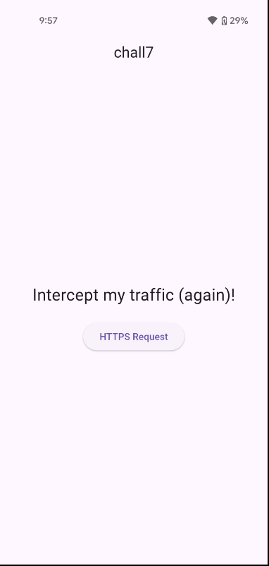

Clicking the button triggers an HTTPS request and displays a success message with a `200 OK` status code, just like in the previous challenge.

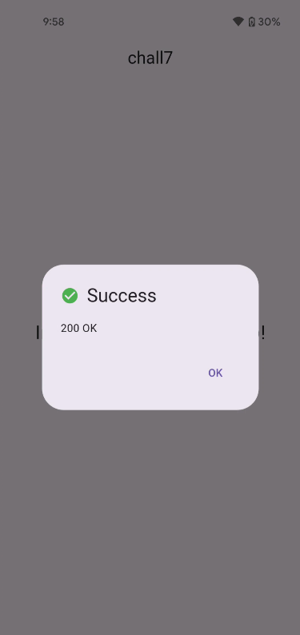

The goal remains the same: intercept the network traffic and extract the flag from the server response. However, this time the application implements security measures that detect tampering, making the static patching approach unfeasible.

## Analysis

### Attempting the ReFlutter Approach
Based on what we learned in the previous challenge, let's start by attempting to patch the application with ReFlutter to intercept the HTTPS traffic.

First, run ReFlutter on the challenge APK:
```shell
$ reflutter ./chall7.apk
[*] Processing...

SnapshotHash: 830f4f59e7969c70b595182826435c19
The resulting apk file: ./release.RE.apk
Please sign, align & install the apk file.

Configure TunProxy (Android) to use your Burp Suite proxy server.
```

Next, sign the patched APK using [Uber APK Signer](https://github.com/patrickfav/uber-apk-signer/releases):
```shell
$ java -jar ./uber-apk-signer-1.3.0.jar --apks ./release.RE.apk
source:
        ./chall7/build/app/outputs/flutter-apk
zipalign location: PATH 
        /usr/bin/zipalign
keystore:
        [0] 161a0018 /tmp/temp_15809694291522007796_debug.keystore (DEBUG_EMBEDDED)

01. release.RE.apk

        SIGN
        file: ./chall7/build/app/outputs/flutter-apk/release.RE.apk (18.72 MiB)
        checksum: f25ddffe6e6711466819b75d9a2fd3b35b98a052b45ffd1dbd8fa0b7c6ab342a (sha256)
        - zipalign success
        - sign success

        VERIFY
        file: ./chall7/build/app/outputs/flutter-apk/release.RE-aligned-debugSigned.apk (18.72 MiB)
        checksum: 6f318113c5e3587d08c600cef2ad9f9560a4430b6a97cacf401b55d264376d19 (sha256)
        - zipalign verified
        - signature verified [v1, v2, v3]
                31 warnings
                Subject: CN=Android Debug, OU=Android, O=US, L=US, ST=US, C=US
                SHA256: 1e08a903aef9c3a721510b64ec764d01d3d094eb954161b62544ea8f187b5953 / SHA256withRSA
                Expires: Thu Mar 10 21:10:05 CET 2044

[Sun Jan 11 22:04:38 CET 2026][v1.3.0]
Successfully processed 1 APKs and 0 errors in 0.86 seconds.
```

Now install the signed, patched APK:
```shell
# remove application if installed
$ adb uninstall com.flutter_labs.chall7
Success

# install patched application
$ adb install release.RE-aligned-debugSigned.apk 
Performing Streamed Install
Success
```

When we launch the patched application and attempt to make a network request, we encounter an error page displaying "File integrity error. The application has been tampered" that prevents us from proceeding.

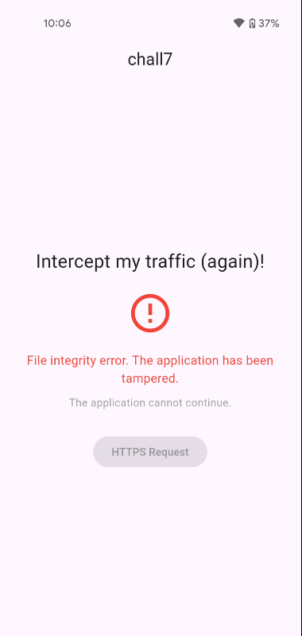

As we discovered in [chall5](../../chall5/solution/solution.md), Flutter applications can delegate platform-specific code to the platform layer (Java/Kotlin on Android, Swift/Objective-C on iOS) to implement integrity checks that detect binary modifications. Since ReFlutter works by patching the `libflutter.so` binary, it fundamentally alters the application's file hash, which triggers these anti-tampering protections and causes the app to refuse execution.

While we could use Frida to hook the Java integrity check methods and bypass this protections, doing so would defeat the purpose of this challenge. Our goal here is to explore alternative approaches to intercepting Flutter traffic that don't require modifying the APK. When static patching fails due to security measures, dynamic instrumentation offers a powerful alternative that operates entirely at runtime without touching the application's files.

### Dynamic Traffic Interception with Frida
Instead of statically patching the application with ReFlutter, we can take a fully dynamic approach using Frida. By hooking the native methods responsible for HTTPS communication at runtime, we can intercept and redirect traffic without modifying the APK at all. This is particularly useful when the application enforces integrity checks or signature validation.

#### Understanding Flutter's Networking Stack
Before diving into runtime hooking, it's important to understand how Flutter handles HTTPS connections internally.

Flutter relies on BoringSSL, Google's fork of OpenSSL, for all cryptographic operations, including TLS. BoringSSL is statically compiled into the Flutter engine binary, `libflutter.so`. When a Flutter application performs an HTTPS request, the flow looks roughly like this:
- Dart code invokes networking APIs from `dart:io`;
- These APIs delegate the request to native code inside `libflutter.so`;
- The Flutter engine creates and manages the socket;
- BoringSSL performs the TLS handshake and certificate verification;

From an interception perspective, the most interesting native functions are:
- `ssl_verify_peer_cert`: validates the server's certificate;
- `ssl_crypto_x509_session_verify_cert_chain`: verifies the certificate chain;
- Socket-related functions: responsible for establishing the network connection;

By hooking these functions, we can:
- Force certificate validation to always succeed, effectively bypassing SSL pinning and accepting our MITM certificate;
- Redirect outbound connections through a proxy such as Burp Suite;

This technique was originally pioneered by security researchers at NVISO Security, who published an in-depth blog series (references at the end of the section) on reversing Flutter applications and released a Frida script capable of disabling Flutter TLS verification.

#### Analyzing `libflutter.so` in Ghidra
Before we can hook the necessary functions, we need to understand the structure of `libflutter.so`. Let's extract and analyze it using Ghidra.
```shell
$ apktool d chall7.apk 
I: Using Apktool 2.8.1 on chall7.apk
I: Loading resource table...
I: Decoding AndroidManifest.xml with resources...
I: Loading resource table from file: /home/bruno/.local/share/apktool/framework/1.apk
I: Regular manifest package...
I: Decoding file-resources...
I: Decoding values */* XMLs...
I: Baksmaling classes.dex...
I: Copying assets and libs...
I: Copying unknown files...
I: Copying original files...
I: Copying META-INF/services directory
```

The extracted `libflutter.so` can be found in `chall7/lib/arm64-v8a/libflutter.so` (for 64-bit ARM devices). Since `libflutter.so` is typically a large, stripped binary, symbol-based analysis is not possible. Instead, we rely on byte pattern matching to locate the functions we want to hook.

Previous research by NVISO showed that several TLS‑related functions in Flutter contain distinctive assembly instruction sequences that remain relatively stable across different Flutter versions. These byte patterns can be searched for both statically (using Ghidra) and dynamically (using Frida).

For example, the `ssl_verify_peer_cert` function contains a unique ARM64 instruction pattern that can be reliably identified.

**File:** `disable-flutter-tls-verification/disable-flutter-tls.js`
```shell
...
    "android":{
        "modulename": "libflutter.so",
        "patterns":{
            "arm64": [
                "F? 0F 1C F8 F? 5? 01 A9 F? 5? 02 A9 F? ?? 03 A9 ?? ?? ?? ?? 68 1A 40 F9",
                "F? 43 01 D1 FE 67 01 A9 F8 5F 02 A9 F6 57 03 A9 F4 4F 04 A9 13 00 40 F9 F4 03 00 AA 68 1A 40 F9",
                "FF 43 01 D1 FE 67 01 A9 ?? ?? 06 94 ?? 7? 06 94 68 1A 40 F9 15 15 41 F9 B5 00 00 B4 B6 4A 40 F9",
            ],
...
```

In practice, we use this pattern to locate the function at runtime. The Frida script scans the process memory for the specified byte sequence, computes the corresponding function address, and hooks it to bypass certificate validation.

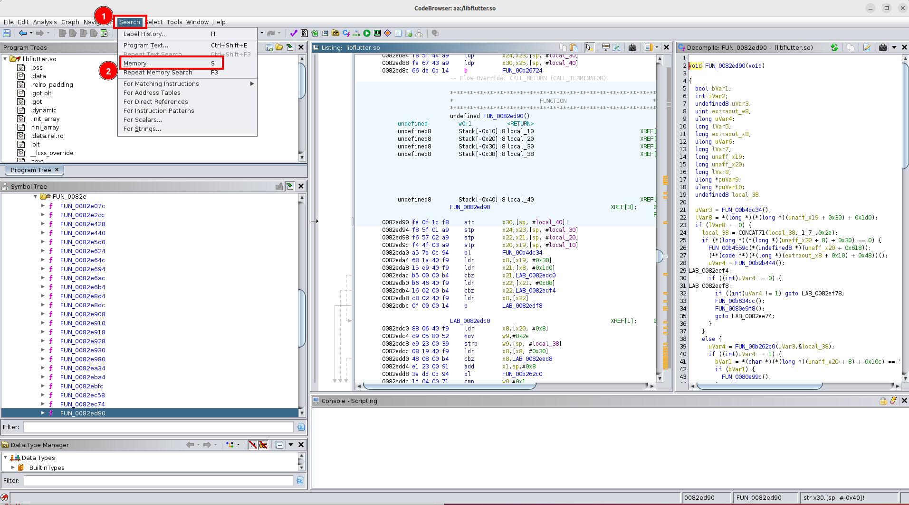

In Ghidra, you can manually verify this by using "Search > Memory" and insert the pattern:

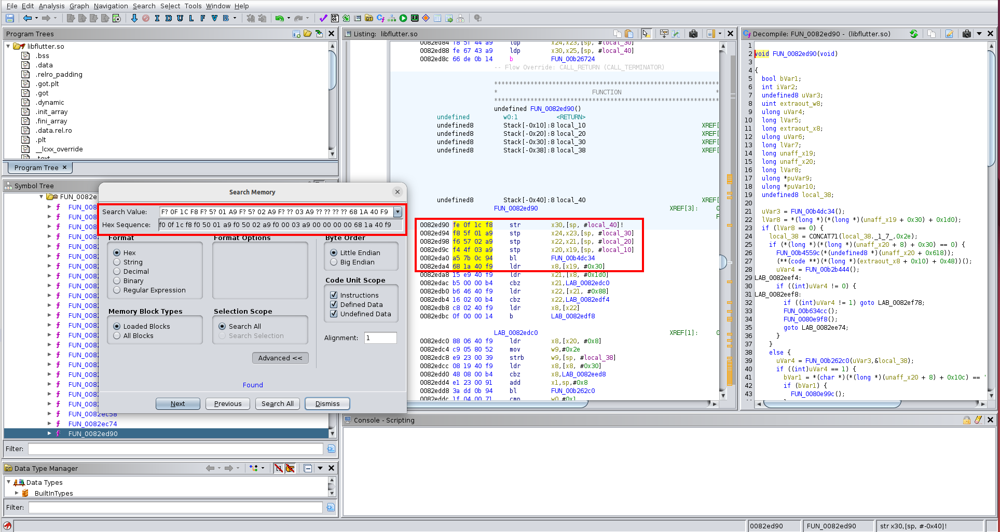

Once the pattern is matched, you have effectively identified the offset of `ssl_verify_peer_cert` within `libflutter.so`. This offset is then used by the Frida script to hook the function at runtime.

### Approach 1: NVISO Script
Understanding how the bypass works is useful, but there is little value in re-implementing the logic ourselves when a mature and well-researched solution already exists. Instead, we can directly leverage the original [Frida script](https://github.com/NVISOsecurity/disable-flutter-tls-verification/blob/main/disable-flutter-tls.js) published by NVISO Security.

Using the NVISO script as-is provides several practical benefits. It supports a wide range of Flutter engine versions, includes multiple fallback byte patterns to handle differences between builds, works on both ARM32 and ARM64, and has been validated through real-world testing over several years.

At runtime, the script attempts to locate the Flutter engine library (`libflutter.so`) in memory. Once the module is loaded, it scans executable memory regions using architecture-specific byte patterns to identify the internal BoringSSL routine responsible for peer certificate verification. Because Flutter binaries typically strip symbols, the script does not rely on exported function names and instead matches known instruction sequences.

When a match is found, the script hooks the internal verification function (specifically the implementation corresponding to `ssl_verify_peer_cert`) and replaces it with a stub that immediately returns success. This modification occurs entirely in memory and affects all TLS handshakes performed by the Flutter engine. The script logs each successful match and patch, making it easy to confirm whether the hook was applied correctly and to debug cases where pattern matching fails.

Since the hook is applied at the BoringSSL level inside the Flutter engine, it applies uniformly to all Dart-side networking code, independent of the specific HTTP client or library in use. No changes are made to the application binary itself.

The original script is available through NVISO's research repository and accompanying blog posts. No modifications are required.

Before running the script, a system-level proxy must be configured, as done previously in [chall6](../../chall6/solution/solution.md). Since the application does not contain a hardcoded proxy configuration, traffic interception must occur at the network layer. This requires tools like ProxyDroid to transparently redirecting network traffic without relying on per-application proxy settings.

With ProxyDroid enabled, run the script to launch the target application and inject the hooks during startup. If everything works as expected, log messages will confirm that the relevant verification routines inside `libflutter.so` have been successfully located and patched.

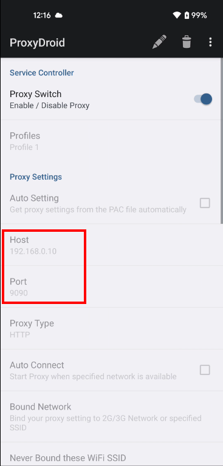

```shell
$ frida -U -f com.flutter_labs.chall7 -l ./disable-flutter-tls-verification/disable-flutter-tls.js
     ____
    / _  |   Frida 16.7.13 - A world-class dynamic instrumentation toolkit
   | (_| |
    > _  |   Commands:
   /_/ |_|       help      -> Displays the help system
   . . . .       object?   -> Display information about 'object'
   . . . .       exit/quit -> Exit
   . . . .
   . . . .   More info at https://frida.re/docs/home/
   . . . .
   . . . .   Connected to Pixel 4a (id=)
Spawning `com.flutter_labs.chall7`...                                   
[+] Pattern version: May 19 2025
[+] Arch: arm64
[+] Platform:  linux
[ ] Locating Flutter library 1/5
Spawned `com.flutter_labs.chall7`. Resuming main thread!                
[Pixel 4a::com.flutter_labs.chall7 ]-> [ ] Locating Flutter library 2/5
[+] Flutter library located
[+] ssl_verify_peer_cert found at offset: 0x72ed90
[+] ssl_verify_peer_cert has been patched
```

Once the application is running, you must trigger the relevant network request from within the app. The decrypted HTTPS traffic should then appear in Burp Suite. Since the APK itself is never modified, this technique continues to work even when the application enforces strict signature validation or runtime integrity checks.

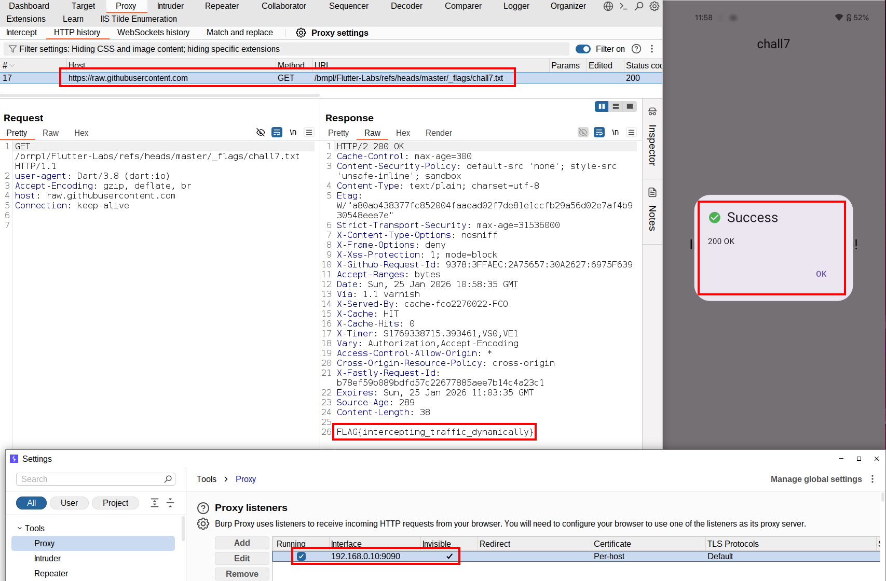

References:
- https://blog.nviso.eu/2020/05/20/intercepting-flutter-traffic-on-android-x64/
- https://blog.nviso.eu/2022/08/18/intercept-flutter-traffic-on-ios-and-android-http-https-dio-pinning/

### Approach 2: Using frida-flutterproxy
While the NVISO script is extremely flexible and reliable, it requires some manual setup, particularly when redirecting traffic through a proxy using tools such as ProxyDroid. For a more automated workflow, [frida-flutterproxy](https://github.com/hackcatml/frida-flutterproxy/) provides a plug-and-play alternative.

This project, developed by [hackcatml](https://github.com/hackcatml), builds on the same foundational research but wraps it into a higher-level abstraction. Rather than relying on system-wide proxy configuration, frida-flutterproxy hooks the native socket creation functions and transparently redirects traffic to a proxy listener. This eliminates the need for lower-level proxy tooling like ProxyDroid or manual `adb` proxy configuration.

Regarding compatibility, the script version you need depends on the Frida release in use. If you are using Frida 17 or newer, the script available in the main branch of the repository can be used directly. For Frida versions below 17, the main branch is not compatible, and you must instead use an earlier revision of the script ([script for frida<17](https://github.com/hackcatml/frida-flutterproxy/blob/30517f2b22aceb5ad667536a936e90ee9d209378/script.js)).

Since this setup uses Frida 16.7.13, the script from the commit above was used with minimal modifications, primarily to configure the proxy IP address and port.

**File:** `./script_frida_less_17.js`
```js
...
    // edit here for proxy ip and port
    BURP_PROXY_IP = "192.168.0.10";
    BURP_PROXY_PORT = 9090;

    awaitForCondition(init);
}
```

Running the script (remember to disable ProxyDroid if you are trying this after the previous NVISO solution):
```shell
$ frida -U -f com.flutter_labs.chall7 -l ./script_frida_less_17.js 
     ____
    / _  |   Frida 16.7.13 - A world-class dynamic instrumentation toolkit
   | (_| |
    > _  |   Commands:
   /_/ |_|       help      -> Displays the help system
   . . . .       object?   -> Display information about 'object'
   . . . .       exit/quit -> Exit
   . . . .
   . . . .   More info at https://frida.re/docs/home/
   . . . .
   . . . .   Connected to Pixel 4a (id=)
Spawned `com.flutter_labs.chall7`. Resuming main thread!                
[Pixel 4a::com.flutter_labs.chall7 ]-> [*] libflutter.so loaded!
[*] libflutter.so base: 0x7270ca6000
[*] package name: com.flutter_labs.chall7
[*] ssl_client string pattern found at: 0x7270e6168a
[*] Socket_CreateConnect string pattern found at: 0x7270e62985
[*] scan memory done
[*] scan memory done
[*] Found Socket_CreateConnect function address: 0x727151d078
[*] Found GetSockAddr function address: 0x7271523708
[*] Hook GetSockAddr function
[*] scan memory done
[*] Found adrp add address: 0x72713e4f68
[*] Found verify_cert_chain function address: 0x72713e4e88
[*] Hook verify_cert_chain function
[*] scan memory done
[*] Overwrite sockaddr as our burp proxy ip and port --> 192.168.0.10:9090
```

As the previous approach, once the application is running, you must trigger the relevant network request from within the app. The decrypted HTTPS traffic should then appear in Burp Suite.

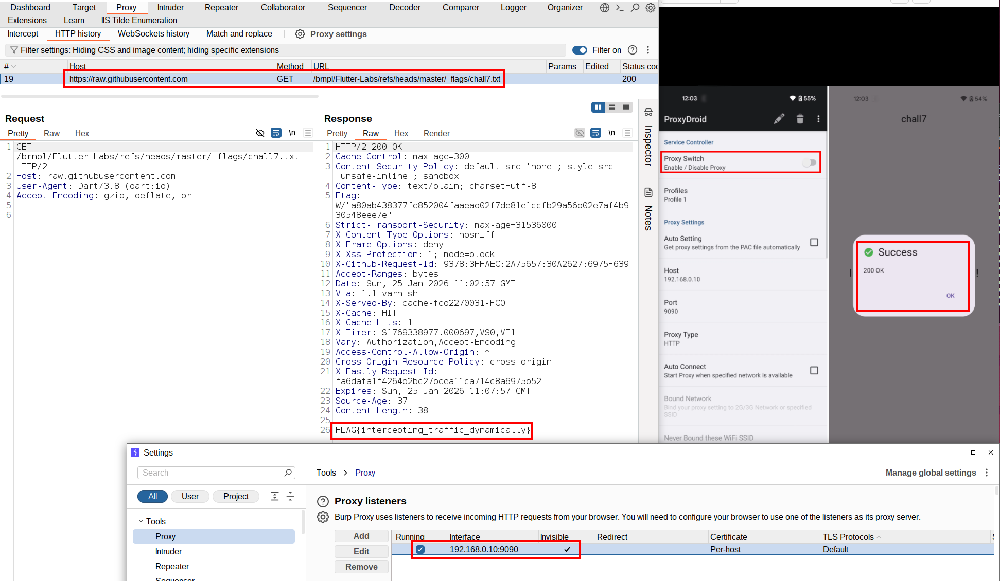

It is important to note that this approach only affects traffic generated by native Flutter networking code. If the application also embeds WebViews, any traffic originating from those components will bypass this mechanism. In such cases, you will still need a system-level proxy configuration (ProxyDroid, `adb proxy settings`, or similar) to capture that traffic.

References:
- https://hackcatml.tistory.com/197

## Flag
FLAG{intercepting_traffic_dynamically}

---

# Deep Dive: Finding `ssl_crypto_x509_session_verify_cert_chain` manually
While automated tools like frida-flutterproxy and the NVISO script handle function detection through runtime searching and pattern matching, understanding how to manually identify these functions using static analysis provides valuable insight into Flutter's internals and gives you more control when automated approaches fail.

This deep dive demonstrates how to use Ghidra to manually locate `ssl_crypto_x509_session_verify_cert_chain` (the method hooked with frida-flutterproxy) in `libflutter.so` and create a minimal Frida script based on hardcoded offsets.

## Understanding the Certificate Verification Functions
Flutter's networking stack relies on BoringSSL (Google's fork of OpenSSL) for TLS/SSL operations. During an HTTPS connection, several functions are involved in certificate validation.

### `ssl_verify_peer_cert` (NVISO's Target)
`ssl_verify_peer_cert` is a high‑level BoringSSL function that drives peer certificate verification during the TLS handshake. It takes a single argument, the SSL handshake context, coordinates multiple lower‑level validation steps, and returns `ssl_verify_ok` (1) on success or `ssl_verify_invalid` (0) on failure.

NVISO's script locates this function using byte‑pattern matching rather than symbols, relying on distinctive instruction sequences that remain relatively stable across Flutter versions and architectures.

**File:** `ssl/handshake.cc`
```c
enum ssl_verify_result_t ssl_verify_peer_cert(SSL_HANDSHAKE *hs) {
...
```

### `ssl_crypto_x509_session_verify_cert_chain` (frida-flutterproxy's Target)
`ssl_crypto_x509_session_verify_cert_chain` is a lower‑level routine in the TLS verification flow. It receives three parameters: the session or handshake context, the certificate chain, and a pointer used to return a TLS alert value when verification fails. Its responsibility is to validate the full certificate chain and propagate detailed error information via the output parameter, while returning a boolean value indicating success or failure.

**File:** `ssl/ssl_x509.cc`
```c
static bool ssl_crypto_x509_session_verify_cert_chain(SSL_SESSION *session, SSL_HANDSHAKE *hs, uint8_t *out_alert)
...
      !X509_STORE_CTX_set_default(
          ctx.get(),
          ssl->server ? "ssl_client" : "ssl_server") || 
...
```

frida‑flutterproxy identifies this function by combining string‑reference analysis, most notably searching for the "ssl_client" string, with targeted pattern matching. Once located, it hooks this function to bypass certificate validation and additionally hooks socket‑creation logic to redirect network traffic.

### Why Different Functions?
Both approaches bypass certificate validation but operate at different layers of the TLS verification flow. NVISO hooks `ssl_verify_peer_cert`, which sits higher in the call stack and controls the entire peer verification process, while frida‑flutterproxy targets `ssl_crypto_x509_session_verify_cert_chain`, a lower‑level function that performs the actual certificate chain validation. In practice, either hook is sufficient, because both functions must ultimately return success for the TLS handshake to complete.

To manually locate `session_verify_cert_chain`, the same technique used by frida‑flutterproxy can be applied in Ghidra. Start by opening `libflutter.so` and searching for the string "ssl_client" (1), which BoringSSL consistently uses in certificate‑related code paths. This string serves as a reliable anchor across versions. After finding it, inspect its cross‑references (2) to see where it is used in code. Among the references, look for a function that takes exactly three parameters (3).

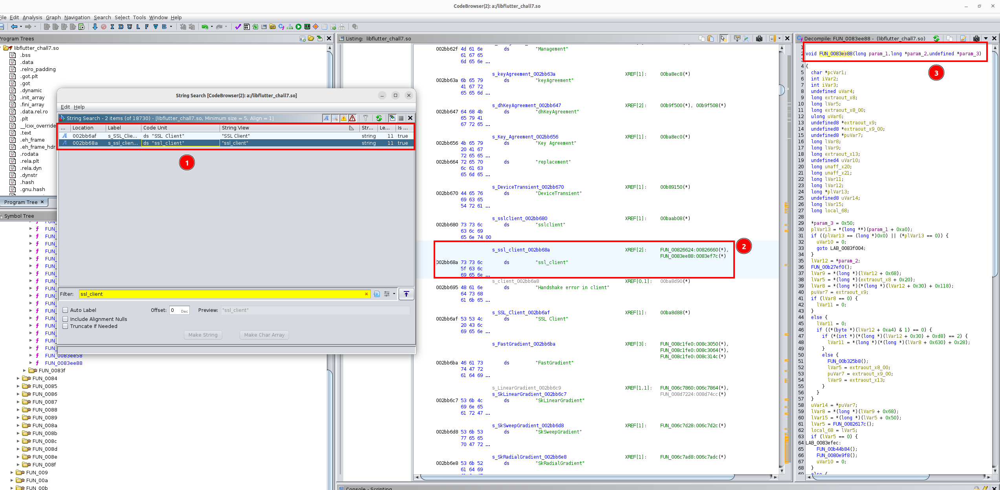

Once the function is identified in Ghidra, the address shown there must be interpreted correctly before using it in a Frida hook. In this case, Ghidra does not assume a zero base address for `libflutter.so`. Instead, the ELF loader maps the image with a base of `0x00100000`, as indicated by the loadable segment information. This means the address displayed in Ghidra, `0x0083ee88`, is relative to that image base rather than to zero.

To obtain the correct runtime offset, the Ghidra image base must be subtracted from the displayed address. Subtracting `0x00100000` from `0x0083ee88` yields `0x0073ee88`, which is the actual position-independent offset of the function within the library. This offset is the value that should be used.

With the offset known, a Frida hook can be written without any pattern matching. At runtime, Frida resolves the base address of `libflutter.so`, adds the offset of `ssl_crypto_x509_session_verify_cert_chain` to compute the function's true address, and attaches a hook. In the hook, the error output byte is cleared on entry, and the return value is forced to 1 on exit. This causes certificate verification to always succeed, achieving the same bypass as frida‑flutterproxy's validation hook, but without additional socket‑redirection logic.

**File:** `script_manual_hooking.js`
```javascript
const MODULE_NAME = "libflutter.so";
const FUNC_OFFSET = 0x73ee88; // ssl_crypto_x509_session_verify_cert_chain entry (from ghidra)

function hook_session_verify_cert_chain() {
  const base = Module.findBaseAddress(MODULE_NAME);
  if (!base) {
    console.log("[ ] libflutter.so not loaded yet, retrying...");
    setTimeout(hook_session_verify_cert_chain, 200);
    return;
  }

  const target = base.add(FUNC_OFFSET);

  console.log("[+] libflutter.so found at", base);
  console.log("[+] Hooking ssl_crypto_x509_session_verify_cert_chain at", target);

  Interceptor.attach(target, {
    onEnter(args) {
      console.log("[+] ssl_crypto_x509_session_verify_cert_chain called");

      // args[2] == param_3 (error byte*)
      if (!args[2].isNull()) {
        Memory.writeU8(args[2], 0); // clear error
      }
    },
    onLeave(retval) {
      retval.replace(1); // force success
      console.log("[+] ssl_crypto_x509_session_verify_cert_chain hooked");
    }
  });
}

// start
setTimeout(hook_session_verify_cert_chain, 1000);
```

After configuring ProxyDroid, loading the Frida script, and triggering a network request in the app, HTTPS traffic can now be intercepted and decrypted in Burp Suite. This confirms that certificate validation has been successfully bypassed.

```shell
$ frida -U -f com.flutter_labs.chall7 -l ./script_manual_hooking.js
     ____
    / _  |   Frida 16.7.13 - A world-class dynamic instrumentation toolkit
   | (_| |
    > _  |   Commands:
   /_/ |_|       help      -> Displays the help system
   . . . .       object?   -> Display information about 'object'
   . . . .       exit/quit -> Exit
   . . . .
   . . . .   More info at https://frida.re/docs/home/
   . . . .
   . . . .   Connected to Pixel 4a (id=)
Spawned `com.flutter_labs.chall7`. Resuming main thread!                
[Pixel 4a::com.flutter_labs.chall7 ]-> [+] libflutter.so found at 0x726fab2000
[+] Hooking ssl_crypto_x509_session_verify_cert_chain at 0x72701f0e88
[+] ssl_crypto_x509_session_verify_cert_chain called
[+] ssl_crypto_x509_session_verify_cert_chain hooked
```

Screenshot:

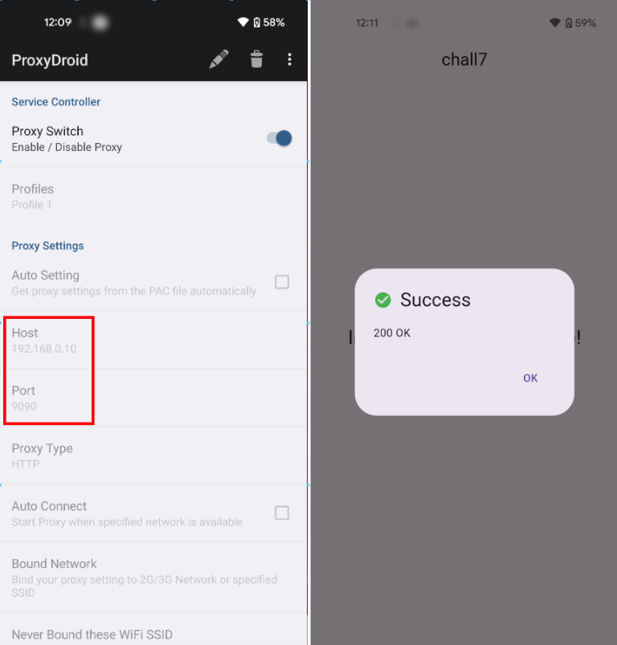

Screenshot:

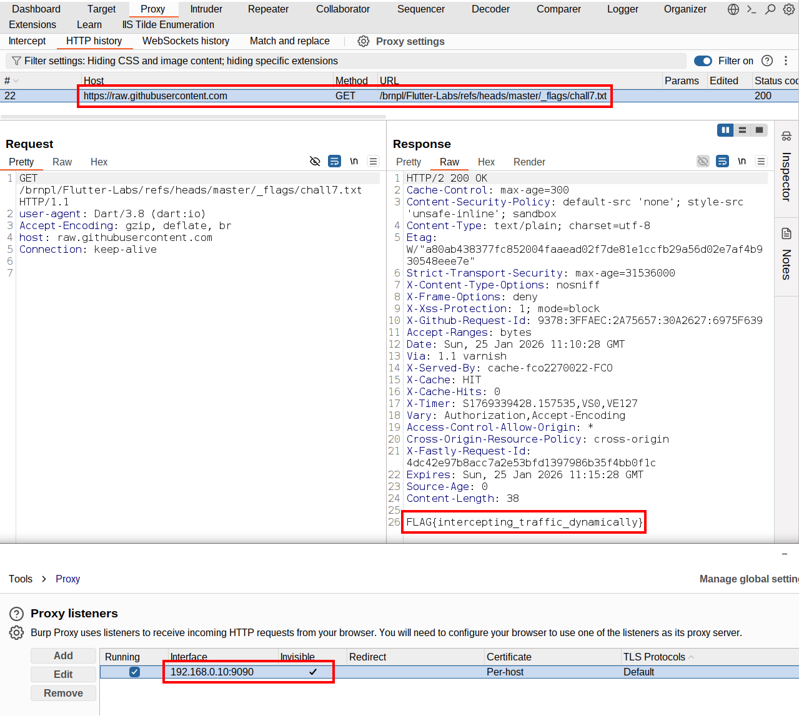