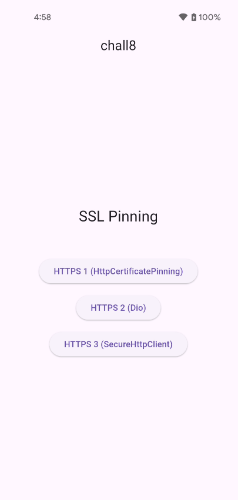
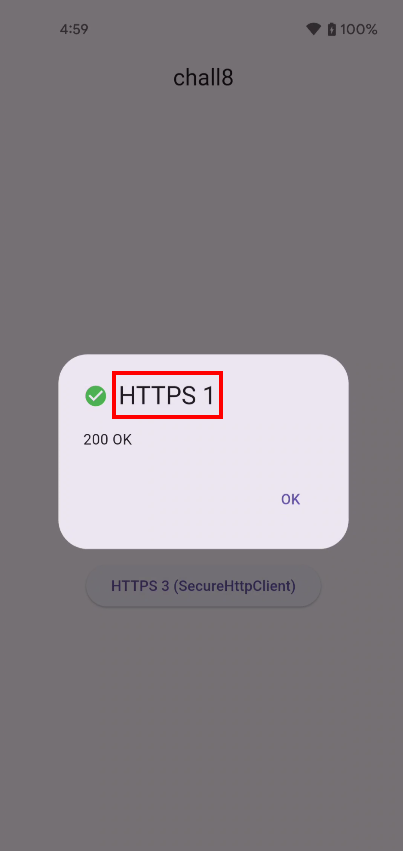
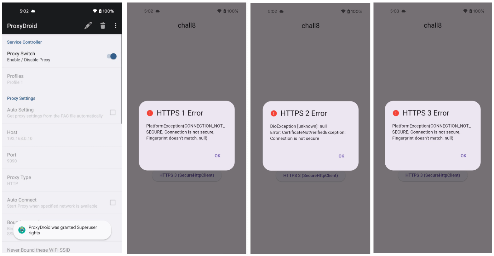
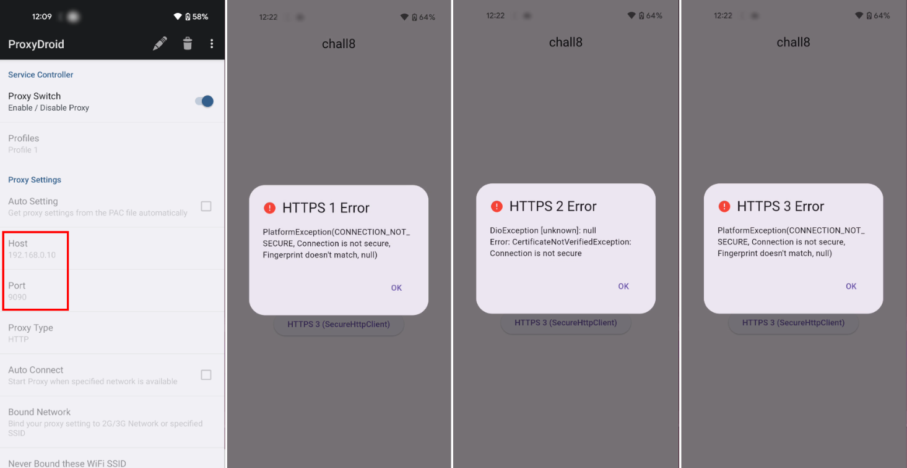
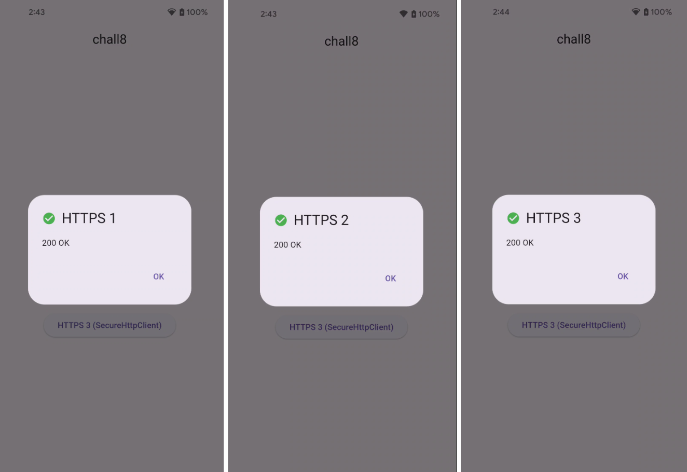
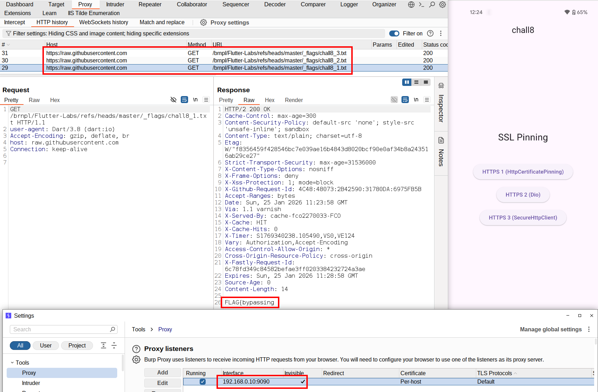

# Challenge 8: Release Mode - Bypassing SSL Pinning
## Overview
Welcome to Challenge 8! This challenge explores SSL pinning implementations and demonstrates how to bypass them using the techniques learned in previous challenges. When you launch the app, you're presented with an interface showing three different buttons, each representing a different SSL pinning implementation approach.



Clicking any of the buttons triggers an HTTPS request to a pinned host. If the certificate validation succeeds, you'll see a success message with a `200 OK` status code.



The goal of this challenge is to understand how SSL pinning works in Flutter, discover why common bypass techniques fail against properly implemented pinning, and successfully intercept the pinned traffic to extract the flag.


## Analysis
### Understanding SSL Pinning
SSL pinning (also called certificate pinning) is a security technique that prevents man-in-the-middle (MITM) attacks by hardcoding or embedding the expected certificate (or its public key) directly into the application. Instead of trusting any certificate signed by a system-trusted Certificate Authority, the application only trusts specific certificates it knows about.

In a typical HTTPS connection without pinning:
- The server presents its certificate during the TLS handshake;
- The client verifies the certificate is signed by a trusted CA;
- If valid, the connection proceeds;

With SSL pinning:
- The server presents its certificate during the TLS handshake;
- The client verifies the certificate is signed by a trusted CA;
- **Additionally, the client checks if the certificate matches the pinned certificate/public key;**
- Only if both checks pass does the connection proceed;

This means that even if an attacker installs a custom CA certificate (like Burp Suite's) on the device, the pinned connection will fail because the presented certificate doesn't match the expected pin.

### Intercepting Traffic
Let's start by testing the approaches we learned in previous challenges to see if they work against SSL pinning.

### Attempt 1: ReFlutter (Static Patching)
First, let's try patching the application with ReFlutter:
```shell
$ reflutter chall8.apk 
[*] Processing...

SnapshotHash: 830f4f59e7969c70b595182826435c19
The resulting apk file: ./release.RE.apk
Please sign, align & install the apk file.

Configure TunProxy (Android) to use your Burp Suite proxy server.
```

Sign the patched APK:
```shell
$ java -jar ./uber-apk-signer-1.3.0.jar --apks ./release.RE.apk
source:
        ./chall8/build/app/outputs/flutter-apk
zipalign location: PATH 
        /usr/bin/zipalign
keystore:
        [0] 161a0018 /tmp/temp_14626180299400267830_debug.keystore (DEBUG_EMBEDDED)

01. release.RE.apk

        SIGN
        file: ./chall8/build/app/outputs/flutter-apk/release.RE.apk (19.06 MiB)
        checksum: a854f67c3824403d69a3677023ae3116873e691ac1e98389a0f9090b7eea8de8 (sha256)
        - zipalign success
        - sign success

        VERIFY
        file: ./chall8/build/app/outputs/flutter-apk/release.RE-aligned-debugSigned.apk (19.06 MiB)
        checksum: adc009b3f2a303a90559d73073adbd90071d4bf32216ef266f909786f6f5187a (sha256)
        - zipalign verified
        - signature verified [v1, v2, v3]
                31 warnings
                Subject: CN=Android Debug, OU=Android, O=US, L=US, ST=US, C=US
                SHA256: 1e08a903aef9c3a721510b64ec764d01d3d094eb954161b62544ea8f187b5953 / SHA256withRSA
                Expires: Thu Mar 10 21:10:05 CET 2044

[Fri Jan 16 17:01:24 CET 2026][v1.3.0]
Successfully processed 1 APKs and 0 errors in 0.76 seconds.
```

Install the patched application:
```shell
$ adb uninstall com.flutter_labs.chall8

$ adb install release.RE-aligned-debugSigned.apk
Performing Streamed Install
Success
```

Configure ProxyDroid (as done in [chall6](../../chall6/solution/solution.md)) to route traffic through Burp Suite, then launch the application and click any of the three buttons. However, the requests fail and nothing appears in Burp Suite. The SSL pinning is still enforced despite ReFlutter's patches.



### Attempt 2: NVISO Script (Dynamic Patching)
Let's try the dynamic approach with the NVISO script. First, reinstall the original (unpatched) APK:

```shell
$ adb uninstall com.flutter_labs.chall8         
Success

$ adb install chall8.apk                        
Performing Streamed Install
Success
```

Configure ProxyDroid, then run the NVISO script:
```shell
$ frida -U -f com.flutter_labs.chall8 -l ./disable-flutter-tls-verification/disable-flutter-tls.js 
     ____
    / _  |   Frida 16.7.13 - A world-class dynamic instrumentation toolkit
   | (_| |
    > _  |   Commands:
   /_/ |_|       help      -> Displays the help system
   . . . .       object?   -> Display information about 'object'
   . . . .       exit/quit -> Exit
   . . . .
   . . . .   More info at https://frida.re/docs/home/
   . . . .
   . . . .   Connected to Pixel 4a (id=)
Spawning `com.flutter_labs.chall8`...                                   
[+] Pattern version: May 19 2025
[+] Arch: arm64
[+] Platform:  linux
[ ] Locating Flutter library 1/5
Spawned `com.flutter_labs.chall8`. Resuming main thread!                
[Pixel 4a::com.flutter_labs.chall8 ]-> [ ] Locating Flutter library 2/5
[+] Flutter library located
[+] ssl_verify_peer_cert found at offset: 0x72ed90
[+] ssl_verify_peer_cert has been patched
```

The script reports successful patching, but when you launch the application and click the buttons, the requests still fail. No traffic appears in Burp Suite.



### Attempt 3: frida-flutterproxy (Dynamic Patching)
Now let's test frida-flutterproxy, which takes a  different approach than the previous methods. First, configure the script with your Burp Suite proxy settings. Make sure to use the correct script version for your Frida installation (< 17 or > 17). For detailed setup instructions, refer to [chall7](../../chall7/solution/solution.md).

**File:** `script_frida_less_17.js`
```javascript
...
    // edit here for proxy ip and port
    BURP_PROXY_IP = "192.168.0.10";
    BURP_PROXY_PORT = 9090;

    awaitForCondition(init);
}
/* main */
```

Run the script:
```shell
$ frida -U -f com.flutter_labs.chall8 -l script_frida_less_17.js 
     ____
    / _  |   Frida 16.7.13 - A world-class dynamic instrumentation toolkit
   | (_| |
    > _  |   Commands:
   /_/ |_|       help      -> Displays the help system
   . . . .       object?   -> Display information about 'object'
   . . . .       exit/quit -> Exit
   . . . .
   . . . .   More info at https://frida.re/docs/home/
   . . . .
   . . . .   Connected to Pixel 4a (id=)
Spawned `com.flutter_labs.chall8`. Resuming main thread!                
[Pixel 4a::com.flutter_labs.chall8 ]-> [*] libflutter.so loaded!
[*] libflutter.so base: 0x726f432000
[*] package name: com.flutter_labs.chall8
[*] Socket_CreateConnect string pattern found at: 0x726f5ee985
[*] ssl_client string pattern found at: 0x726f5ed68a
[*] scan memory done
[*] scan memory done
[*] Found Socket_CreateConnect function address: 0x726fca9078
[*] Found GetSockAddr function address: 0x726fcaf708
[*] scan memory done
[*] Hook GetSockAddr function
[*] Found adrp add address: 0x726fb70f68
[*] Found verify_cert_chain function address: 0x726fb70e88
[*] Hook verify_cert_chain function
[*] scan memory done
[*] Overwrite sockaddr as our burp proxy ip and port --> 192.168.0.10:9090
[*] Overwrite sockaddr as our burp proxy ip and port --> 192.168.0.10:9090
[*] Overwrite sockaddr as our burp proxy ip and port --> 192.168.0.10:9090
[*] Overwrite sockaddr as our burp proxy ip and port --> 192.168.0.10:9090
[*] Overwrite sockaddr as our burp proxy ip and port --> 192.168.0.10:9090
[*] Overwrite sockaddr as our burp proxy ip and port --> 192.168.0.10:9090
[*] verify cert bypass
[*] Overwrite sockaddr as our burp proxy ip and port --> 192.168.0.10:9090
[*] Overwrite sockaddr as our burp proxy ip and port --> 192.168.0.10:9090
[*] Overwrite sockaddr as our burp proxy ip and port --> 192.168.0.10:9090
[*] Overwrite sockaddr as our burp proxy ip and port --> 192.168.0.10:9090
[*] Overwrite sockaddr as our burp proxy ip and port --> 192.168.0.10:9090
[*] Overwrite sockaddr as our burp proxy ip and port --> 192.168.0.10:9090
[*] verify cert bypass
[*] Overwrite sockaddr as our burp proxy ip and port --> 192.168.0.10:9090
[*] Overwrite sockaddr as our burp proxy ip and port --> 192.168.0.10:9090
[*] Overwrite sockaddr as our burp proxy ip and port --> 192.168.0.10:9090
[*] Overwrite sockaddr as our burp proxy ip and port --> 192.168.0.10:9090
[*] Overwrite sockaddr as our burp proxy ip and port --> 192.168.0.10:9090
[*] Overwrite sockaddr as our burp proxy ip and port --> 192.168.0.10:9090
[*] verify cert bypass
[Pixel 4a::com.flutter_labs.chall8 ]->
```

Note that unlike the NVISO script approach, frida-flutterproxy doesn't require ProxyDroid because it handles proxy redirection internally. 

Launch the application and test all buttons:



All requests are intercepted, and you can see the flag in Burp Suite's HTTP history:



## Flag
FLAG{bypassing_ssl_pinning}

---

# Deep Dive: Understanding Why Different Bypass Methods Succeed or Fail
Now that we've seen which methods work and which don't, let's try to understand the reasons behind these results. We'll analyze what each tool does at the binary level and why SSL pinning requires a different approach than simple TLS verification.

## Understanding the ReFlutter Approach
ReFlutter operates by statically patching the Flutter engine's snapshot to disable TLS verification. It modifies the compiled Dart code before the application launches. However, this approach seems to targets generic TLS verification and it doesn't affect the additional certificate validation layer used by SSL pinning implementations.

Even when ReFlutter successfully disables basic certificate validation, the hardcoded certificate comparison logic remains intact and will reject any certificates that don't match the expected pins.

For those interested in the specific binary modifications ReFlutter makes, have a look at the source code on the project's GitHub repository.

## Understanding the NVISO Approach
The NVISO script takes a dynamic approach by hooking the `ssl_verify_peer_cert` function in BoringSSL at runtime. It locates the Flutter library in memory, finds the target function using pattern matching, and hooks it to always return success. While this successfully bypasses basic TLS verification, it fails against SSL pinning.

## Understanding the frida-flutterproxy Approach
The frida-flutterproxy script bypasses SSL pinning in Flutter by hooking multiple functions inside `libflutter.so`, covering both networking setup and certificate validation. It first intercepts `Socket_CreateConnect` and `GetSockAddr` to influence how network connections are created and routed. After this, it hooks `ssl_crypto_x509_session_verify_cert_chain`, the function responsible for validating TLS certificate chains, including pinning checks, and forces it to succeed.

A key insight is that simply hooking `ssl_crypto_x509_session_verify_cert_chain` is insufficient for bypassing certificate pinning. Testing revealed that targeting this function in isolation fails because it only gets invoked reliably after socket-level redirection has already been established.

## Why Multiple Certificate Validation Paths Exist
The reason both `ssl_verify_peer_cert` (used by NVISO) and `ssl_crypto_x509_session_verify_cert_chain` (used by frida-flutterproxy) exist is that BoringSSL provides multiple code paths for certificate validation. Different implementations and configurations may use different validation functions, which is why a script that works for basic TLS validation might fail against SSL pinning.

When dealing with SSL pinning in Flutter applications, it's advisable to try multiple bypass techniques rather than relying on a single approach. Additionally, reviewing BoringSSL's source code can help you understand which certificate validation functions are actually being used in your specific case, making it easier to target the correct checks.

## Additional Considerations
If the application also performs networking at the platform layer (Android Java/Kotlin) or within WebViews and enforces SSL pinning there, additional bypass techniques may be required beyond the Flutter layer. For these scenarios, you can combine this approach with Android SSL pinning bypass scripts, for example [these ones](https://github.com/akabe1/my-FRIDA-scripts) written by [Maurizio Siddu](https://github.com/akabe1).